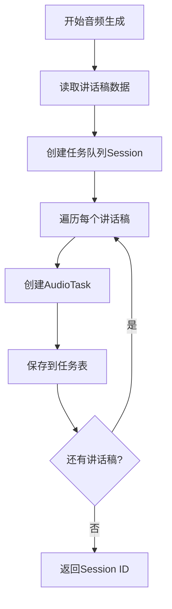
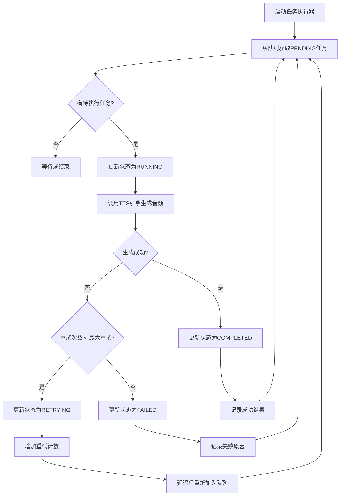

# 音频生成任务管理系统设计方案

## 📋 目标

设计一个可靠的音频生成任务管理系统，实现以下目标：
1. **不使用静默音频** - 每个音频都必须成功生成
2. **任务持久化** - 任务状态记录到数据库/文件
3. **智能重试** - 只重试失败的任务，不从头开始
4. **断点续传** - 支持中断后继续执行
5. **状态追踪** - 完整的任务生命周期管理

---

## 🏗️ 系统架构设计

### 1. 核心组件

```
┌─────────────────────────────────────────────────────────┐
│                   音频生成任务系统                         │
├─────────────────────────────────────────────────────────┤
│                                                          │
│  ┌──────────────┐    ┌──────────────┐   ┌────────────┐ │
│  │  任务调度器   │───→│  任务执行器   │──→│  TTS引擎   │ │
│  │  Scheduler   │    │   Executor   │   │   Engine   │ │
│  └──────────────┘    └──────────────┘   └────────────┘ │
│         │                    │                  │        │
│         ↓                    ↓                  ↓        │
│  ┌──────────────┐    ┌──────────────┐   ┌────────────┐ │
│  │  任务队列     │    │  重试管理器   │   │  状态存储   │ │
│  │  TaskQueue   │    │RetryManager  │   │StateStore  │ │
│  └──────────────┘    └──────────────┘   └────────────┘ │
│                                                          │
└─────────────────────────────────────────────────────────┘
```

### 2. 数据模型

#### 2.1 任务表结构 (AudioTaskQueue)

```python
@dataclass
class AudioTask:
    """音频生成任务"""
    # 基本信息
    task_id: str                    # 任务唯一ID: "audio_001", "audio_002_seg_01"
    session_id: str                 # 会话ID（批次ID）
    page_number: int                # PPT页码
    segment_index: Optional[int]    # 分段索引（AI优化模式）
    
    # 任务内容
    script_content: str             # 待合成的文本内容
    audio_filename: str             # 输出音频文件名
    
    # 任务状态
    status: TaskStatus              # 状态枚举
    priority: int                   # 优先级 (1-10, 数字越大优先级越高)
    
    # 时间信息
    created_at: datetime            # 创建时间
    updated_at: datetime            # 更新时间
    started_at: Optional[datetime]  # 开始执行时间
    completed_at: Optional[datetime] # 完成时间
    
    # 重试信息
    retry_count: int                # 已重试次数
    max_retries: int                # 最大重试次数
    last_error: Optional[str]       # 最后一次错误信息
    error_history: List[Dict]       # 错误历史记录
    
    # 执行结果
    audio_path: Optional[str]       # 生成的音频文件路径
    duration_seconds: Optional[float] # 音频时长
    file_size_bytes: Optional[int]  # 文件大小
    engine_used: Optional[str]      # 使用的TTS引擎
    
    # 元数据
    metadata: Dict[str, Any]        # 其他元数据
```

#### 2.2 任务状态枚举

```python
class TaskStatus(Enum):
    """任务状态"""
    PENDING = "pending"           # 待执行
    RUNNING = "running"           # 执行中
    COMPLETED = "completed"       # 已完成
    FAILED = "failed"             # 失败（达到最大重试次数）
    RETRYING = "retrying"         # 重试中
    CANCELLED = "cancelled"       # 已取消
    PAUSED = "paused"             # 已暂停
```

#### 2.3 任务队列状态表

```python
@dataclass
class TaskQueueState:
    """任务队列状态"""
    session_id: str                 # 会话ID
    project_dir: str                # 项目目录
    total_tasks: int                # 总任务数
    pending_tasks: int              # 待执行任务数
    completed_tasks: int            # 已完成任务数
    failed_tasks: int               # 失败任务数
    
    # 统计信息
    total_duration: float           # 总时长
    success_rate: float             # 成功率
    average_retry_count: float      # 平均重试次数
    
    # 时间信息
    started_at: Optional[datetime]
    completed_at: Optional[datetime]
    estimated_completion: Optional[datetime]
    
    # 配置
    max_concurrent_tasks: int       # 最大并发任务数
    retry_strategy: str             # 重试策略
```

---

## 🔄 任务流程设计

### 1. 任务创建流程



### 2. 任务执行流程



### 3. 重试策略

#### 3.1 指数退避策略

```python
def calculate_retry_delay(retry_count: int) -> int:
    """
    计算重试延迟时间（指数退避）
    
    重试次数 -> 延迟时间
    1 -> 15秒
    2 -> 30秒
    3 -> 60秒
    4 -> 120秒
    5 -> 240秒
    ...
    """
    base_delay = 15  # 基础延迟15秒
    max_delay = 300  # 最大延迟5分钟
    
    delay = base_delay * (2 ** (retry_count - 1))
    return min(delay, max_delay)
```

#### 3.2 智能重试策略

```python
class RetryStrategy:
    """重试策略"""
    
    # 不同错误类型的重试配置
    ERROR_CONFIGS = {
        "SSLError": {
            "max_retries": 10,
            "retry_delay": 15,
            "backoff_multiplier": 1.5
        },
        "TimeoutError": {
            "max_retries": 5,
            "retry_delay": 10,
            "backoff_multiplier": 2.0
        },
        "ConnectionError": {
            "max_retries": 8,
            "retry_delay": 20,
            "backoff_multiplier": 1.5
        },
        "AuthenticationError": {
            "max_retries": 0,  # 认证错误不重试
            "retry_delay": 0,
            "backoff_multiplier": 0
        },
        "Default": {
            "max_retries": 5,
            "retry_delay": 15,
            "backoff_multiplier": 2.0
        }
    }
    
    @staticmethod
    def get_retry_config(error_type: str) -> Dict:
        """根据错误类型获取重试配置"""
        return RetryStrategy.ERROR_CONFIGS.get(
            error_type, 
            RetryStrategy.ERROR_CONFIGS["Default"]
        )
```

---

## 💾 数据持久化设计

### 1. SQLite数据库方案（推荐）

#### 数据库表结构

```sql
-- 任务表
CREATE TABLE audio_tasks (
    task_id TEXT PRIMARY KEY,
    session_id TEXT NOT NULL,
    page_number INTEGER NOT NULL,
    segment_index INTEGER,
    script_content TEXT NOT NULL,
    audio_filename TEXT NOT NULL,
    status TEXT NOT NULL,
    priority INTEGER DEFAULT 5,
    created_at TIMESTAMP NOT NULL,
    updated_at TIMESTAMP NOT NULL,
    started_at TIMESTAMP,
    completed_at TIMESTAMP,
    retry_count INTEGER DEFAULT 0,
    max_retries INTEGER DEFAULT 10,
    last_error TEXT,
    error_history TEXT,  -- JSON格式
    audio_path TEXT,
    duration_seconds REAL,
    file_size_bytes INTEGER,
    engine_used TEXT,
    metadata TEXT,  -- JSON格式
    INDEX idx_session_id (session_id),
    INDEX idx_status (status),
    INDEX idx_priority_status (priority DESC, status)
);

-- 会话表
CREATE TABLE task_sessions (
    session_id TEXT PRIMARY KEY,
    project_dir TEXT NOT NULL,
    total_tasks INTEGER NOT NULL,
    pending_tasks INTEGER DEFAULT 0,
    completed_tasks INTEGER DEFAULT 0,
    failed_tasks INTEGER DEFAULT 0,
    total_duration REAL DEFAULT 0.0,
    success_rate REAL DEFAULT 0.0,
    average_retry_count REAL DEFAULT 0.0,
    started_at TIMESTAMP,
    completed_at TIMESTAMP,
    estimated_completion TIMESTAMP,
    max_concurrent_tasks INTEGER DEFAULT 3,
    retry_strategy TEXT DEFAULT 'exponential',
    metadata TEXT,  -- JSON格式
    created_at TIMESTAMP NOT NULL
);
```

### 2. JSON文件方案（备选）

```json
// task_queue_<session_id>.json
{
  "session_id": "session_20251010_153456",
  "project_dir": "/path/to/project",
  "created_at": "2025-10-10T15:34:56",
  "config": {
    "max_retries": 10,
    "retry_delay": 15,
    "max_concurrent_tasks": 3
  },
  "tasks": [
    {
      "task_id": "audio_001",
      "page_number": 1,
      "status": "completed",
      "script_content": "大家好...",
      "audio_filename": "audio_001.wav",
      "retry_count": 0,
      "duration_seconds": 12.02,
      "created_at": "2025-10-10T15:34:56",
      "completed_at": "2025-10-10T15:35:10"
    },
    {
      "task_id": "audio_002",
      "page_number": 2,
      "status": "failed",
      "script_content": "主要有两步...",
      "audio_filename": "audio_002.wav",
      "retry_count": 10,
      "last_error": "Fish TTS failed after 10 attempts",
      "error_history": [
        {
          "timestamp": "2025-10-10T15:35:15",
          "error": "SSLError",
          "retry_count": 1
        }
      ],
      "created_at": "2025-10-10T15:35:11",
      "updated_at": "2025-10-10T15:37:30"
    }
  ],
  "statistics": {
    "total_tasks": 38,
    "completed": 36,
    "failed": 1,
    "pending": 1,
    "success_rate": 0.947
  }
}
```

---

## 🔧 核心类实现

### 1. AudioTaskQueue - 任务队列管理器

```python
class AudioTaskQueue:
    """音频任务队列管理器"""
    
    def __init__(self, session_id: str, project_dir: Path, 
                 storage_type: str = "sqlite"):
        """
        初始化任务队列
        
        Args:
            session_id: 会话ID
            project_dir: 项目目录
            storage_type: 存储类型 ('sqlite' 或 'json')
        """
        self.session_id = session_id
        self.project_dir = Path(project_dir)
        self.storage = self._init_storage(storage_type)
        self.logger = get_logger(__name__, project_dir / "logs")
        
    def create_tasks_from_scripts(self, scripts_data: Dict) -> int:
        """
        从讲话稿数据创建任务
        
        Returns:
            创建的任务数量
        """
        scripts = scripts_data.get("scripts", [])
        tasks_created = 0
        
        for i, script in enumerate(scripts):
            task = AudioTask(
                task_id=f"audio_{i+1:03d}",
                session_id=self.session_id,
                page_number=script.get("slide_number", i+1),
                segment_index=None,
                script_content=script.get("text", ""),
                audio_filename=f"audio_{i+1:03d}.wav",
                status=TaskStatus.PENDING,
                priority=5,
                created_at=datetime.now(),
                updated_at=datetime.now(),
                retry_count=0,
                max_retries=10,
                error_history=[],
                metadata={}
            )
            
            self.storage.save_task(task)
            tasks_created += 1
        
        self.logger.info(f"创建了 {tasks_created} 个音频任务")
        return tasks_created
    
    def get_next_task(self) -> Optional[AudioTask]:
        """
        获取下一个待执行的任务（按优先级和创建时间排序）
        
        Returns:
            待执行的任务，如果没有则返回None
        """
        return self.storage.get_next_pending_task()
    
    def update_task_status(self, task_id: str, status: TaskStatus, 
                          **kwargs):
        """更新任务状态"""
        task = self.storage.get_task(task_id)
        if task:
            task.status = status
            task.updated_at = datetime.now()
            
            # 更新其他字段
            for key, value in kwargs.items():
                if hasattr(task, key):
                    setattr(task, key, value)
            
            self.storage.save_task(task)
    
    def mark_task_failed(self, task_id: str, error: str):
        """标记任务失败"""
        task = self.storage.get_task(task_id)
        if task:
            task.status = TaskStatus.FAILED
            task.last_error = error
            task.error_history.append({
                "timestamp": datetime.now().isoformat(),
                "error": error,
                "retry_count": task.retry_count
            })
            task.updated_at = datetime.now()
            self.storage.save_task(task)
    
    def get_failed_tasks(self) -> List[AudioTask]:
        """获取所有失败的任务"""
        return self.storage.get_tasks_by_status(TaskStatus.FAILED)
    
    def get_statistics(self) -> Dict:
        """获取队列统计信息"""
        all_tasks = self.storage.get_all_tasks()
        
        total = len(all_tasks)
        completed = len([t for t in all_tasks if t.status == TaskStatus.COMPLETED])
        failed = len([t for t in all_tasks if t.status == TaskStatus.FAILED])
        pending = len([t for t in all_tasks if t.status == TaskStatus.PENDING])
        
        return {
            "session_id": self.session_id,
            "total_tasks": total,
            "completed": completed,
            "failed": failed,
            "pending": pending,
            "running": len([t for t in all_tasks if t.status == TaskStatus.RUNNING]),
            "success_rate": completed / total if total > 0 else 0.0,
            "average_retries": sum(t.retry_count for t in all_tasks) / total if total > 0 else 0.0
        }
```

### 2. AudioTaskExecutor - 任务执行器

```python
class AudioTaskExecutor:
    """音频任务执行器"""
    
    def __init__(self, task_queue: AudioTaskQueue, 
                 tts_manager: IntegratedTTSManager,
                 max_concurrent: int = 3):
        """
        初始化任务执行器
        
        Args:
            task_queue: 任务队列
            tts_manager: TTS管理器
            max_concurrent: 最大并发任务数
        """
        self.task_queue = task_queue
        self.tts_manager = tts_manager
        self.max_concurrent = max_concurrent
        self.logger = get_logger(__name__)
        self.running_tasks: Set[str] = set()
        self.is_running = False
    
    async def start(self):
        """启动任务执行器"""
        self.is_running = True
        self.logger.info("任务执行器启动")
        
        # 创建并发任务池
        tasks = []
        for _ in range(self.max_concurrent):
            task = asyncio.create_task(self._worker())
            tasks.append(task)
        
        # 等待所有worker完成
        await asyncio.gather(*tasks)
        
        self.logger.info("任务执行器停止")
    
    async def _worker(self):
        """工作线程"""
        while self.is_running:
            # 获取下一个待执行任务
            task = self.task_queue.get_next_task()
            
            if task is None:
                # 没有待执行任务，检查是否所有任务都已完成
                stats = self.task_queue.get_statistics()
                if stats['pending'] == 0 and stats['running'] == 0:
                    self.logger.info("所有任务已完成或失败")
                    break
                
                # 等待一段时间后重试
                await asyncio.sleep(1)
                continue
            
            # 执行任务
            await self._execute_task(task)
            
            # 短暂延迟，避免过于频繁的请求
            await asyncio.sleep(0.5)
    
    async def _execute_task(self, task: AudioTask):
        """
        执行单个任务
        
        Args:
            task: 待执行的任务
        """
        self.running_tasks.add(task.task_id)
        self.logger.info(f"开始执行任务: {task.task_id}")
        
        # 更新任务状态为运行中
        self.task_queue.update_task_status(
            task.task_id,
            TaskStatus.RUNNING,
            started_at=datetime.now()
        )
        
        try:
            # 生成音频文件路径
            audio_path = self.task_queue.project_dir / "output" / "audios" / task.audio_filename
            audio_path.parent.mkdir(parents=True, exist_ok=True)
            
            # 调用TTS生成音频
            self.logger.info(f"正在合成语音: {task.script_content[:50]}...")
            
            result = await self.tts_manager.synthesize_speech(
                text=task.script_content,
                output_path=audio_path
            )
            
            if result["success"]:
                # 任务成功
                self.logger.info(f"任务 {task.task_id} 完成: 引擎={result['engine']}, 时长={result['duration']:.2f}s")
                
                self.task_queue.update_task_status(
                    task.task_id,
                    TaskStatus.COMPLETED,
                    completed_at=datetime.now(),
                    audio_path=str(audio_path),
                    duration_seconds=result['duration'],
                    file_size_bytes=result['file_size'],
                    engine_used=result['engine']
                )
            else:
                # TTS失败，判断是否需要重试
                await self._handle_task_failure(task, result.get('error', '未知错误'))
        
        except Exception as e:
            # 发生异常
            self.logger.error(f"执行任务 {task.task_id} 时发生异常: {e}", exc_info=True)
            await self._handle_task_failure(task, str(e))
        
        finally:
            self.running_tasks.remove(task.task_id)
    
    async def _handle_task_failure(self, task: AudioTask, error: str):
        """
        处理任务失败
        
        Args:
            task: 失败的任务
            error: 错误信息
        """
        # 获取错误类型
        error_type = self._classify_error(error)
        retry_config = RetryStrategy.get_retry_config(error_type)
        
        # 判断是否可以重试
        if task.retry_count < min(task.max_retries, retry_config['max_retries']):
            # 可以重试
            task.retry_count += 1
            
            # 计算重试延迟
            delay = self._calculate_retry_delay(
                task.retry_count,
                retry_config['retry_delay'],
                retry_config['backoff_multiplier']
            )
            
            self.logger.warning(
                f"任务 {task.task_id} 失败 (第{task.retry_count}次重试), "
                f"{delay}秒后重试: {error}"
            )
            
            # 更新任务状态为重试中
            self.task_queue.update_task_status(
                task.task_id,
                TaskStatus.RETRYING,
                retry_count=task.retry_count,
                last_error=error
            )
            
            # 延迟后重置为PENDING状态
            await asyncio.sleep(delay)
            
            self.task_queue.update_task_status(
                task.task_id,
                TaskStatus.PENDING
            )
        else:
            # 达到最大重试次数，标记为失败
            self.logger.error(
                f"任务 {task.task_id} 达到最大重试次数 ({task.retry_count}), "
                f"标记为失败: {error}"
            )
            
            self.task_queue.mark_task_failed(task.task_id, error)
    
    def _classify_error(self, error: str) -> str:
        """分类错误类型"""
        if "SSL" in error or "ssl" in error:
            return "SSLError"
        elif "timeout" in error.lower():
            return "TimeoutError"
        elif "connection" in error.lower():
            return "ConnectionError"
        elif "auth" in error.lower():
            return "AuthenticationError"
        else:
            return "Default"
    
    def _calculate_retry_delay(self, retry_count: int, base_delay: int, 
                               multiplier: float) -> int:
        """计算重试延迟（指数退避）"""
        max_delay = 300  # 最大5分钟
        delay = base_delay * (multiplier ** (retry_count - 1))
        return min(int(delay), max_delay)
    
    def stop(self):
        """停止任务执行器"""
        self.is_running = False
        self.logger.info("正在停止任务执行器...")
```

---

## 📊 使用示例

### 1. 创建和执行任务

```python
async def generate_audio_with_task_queue(scripts_data: Dict, project_dir: Path):
    """使用任务队列生成音频"""
    
    # 1. 创建会话ID
    session_id = f"session_{datetime.now().strftime('%Y%m%d_%H%M%S')}"
    
    # 2. 创建任务队列
    task_queue = AudioTaskQueue(session_id, project_dir, storage_type="sqlite")
    
    # 3. 从讲话稿创建任务
    num_tasks = task_queue.create_tasks_from_scripts(scripts_data)
    print(f"创建了 {num_tasks} 个音频生成任务")
    
    # 4. 初始化TTS管理器
    tts_config = load_tts_config_from_app_config()
    tts_manager = IntegratedTTSManager(tts_config)
    
    # 5. 创建任务执行器
    executor = AudioTaskExecutor(
        task_queue=task_queue,
        tts_manager=tts_manager,
        max_concurrent=3  # 最多3个并发任务
    )
    
    # 6. 启动执行器
    await executor.start()
    
    # 7. 获取统计信息
    stats = task_queue.get_statistics()
    print(f"任务完成: {stats['completed']}/{stats['total_tasks']}")
    print(f"成功率: {stats['success_rate']*100:.1f}%")
    
    # 8. 处理失败的任务
    failed_tasks = task_queue.get_failed_tasks()
    if failed_tasks:
        print(f"\n⚠️ 有 {len(failed_tasks)} 个任务失败:")
        for task in failed_tasks:
            print(f"  - {task.task_id}: {task.last_error}")
    
    return stats
```

### 2. 重试失败的任务

```python
async def retry_failed_tasks(session_id: str, project_dir: Path):
    """重试失败的任务"""
    
    # 1. 加载现有任务队列
    task_queue = AudioTaskQueue(session_id, project_dir, storage_type="sqlite")
    
    # 2. 获取失败的任务
    failed_tasks = task_queue.get_failed_tasks()
    
    if not failed_tasks:
        print("没有失败的任务需要重试")
        return
    
    print(f"发现 {len(failed_tasks)} 个失败任务，准备重试...")
    
    # 3. 重置失败任务的状态
    for task in failed_tasks:
        task_queue.update_task_status(
            task.task_id,
            TaskStatus.PENDING,
            retry_count=0,  # 重置重试计数
            last_error=None
        )
    
    # 4. 重新执行
    tts_config = load_tts_config_from_app_config()
    tts_manager = IntegratedTTSManager(tts_config)
    
    executor = AudioTaskExecutor(
        task_queue=task_queue,
        tts_manager=tts_manager,
        max_concurrent=2  # 重试时使用较小的并发数
    )
    
    await executor.start()
    
    # 5. 查看结果
    stats = task_queue.get_statistics()
    print(f"\n重试结果:")
    print(f"  成功: {stats['completed']}")
    print(f"  失败: {stats['failed']}")
```

### 3. 查看任务进度

```python
def get_task_progress(session_id: str, project_dir: Path) -> Dict:
    """获取任务进度"""
    
    task_queue = AudioTaskQueue(session_id, project_dir, storage_type="sqlite")
    stats = task_queue.get_statistics()
    
    return {
        "session_id": session_id,
        "progress": stats['completed'] / stats['total_tasks'] * 100,
        "total": stats['total_tasks'],
        "completed": stats['completed'],
        "failed": stats['failed'],
        "pending": stats['pending'],
        "running": stats['running'],
        "success_rate": stats['success_rate'] * 100
    }
```

---

## 🎯 实施计划

### 阶段1: 核心功能实现（1-2天）
- [x] 设计数据模型和数据库结构
- [ ] 实现 `AudioTask` 和 `TaskStatus` 数据类
- [ ] 实现 `AudioTaskQueue` 任务队列管理器
- [ ] 实现 SQLite 存储适配器

### 阶段2: 执行器实现（1-2天）
- [ ] 实现 `AudioTaskExecutor` 任务执行器
- [ ] 实现 `RetryStrategy` 重试策略
- [ ] 集成现有的 `IntegratedTTSManager`
- [ ] 实现并发控制和工作线程池

### 阶段3: 集成和测试（1-2天）
- [ ] 修改 `step02_tts_generator.py` 使用新的任务队列
- [ ] 实现断点续传功能
- [ ] 编写单元测试
- [ ] 编写集成测试

### 阶段4: 优化和监控（1天）
- [ ] 添加进度监控和日志
- [ ] 实现任务统计和报告
- [ ] 性能优化
- [ ] 文档编写

---

## 💡 优势分析

### 1. 可靠性提升
- ✅ **不丢失任务**: 所有任务持久化到数据库
- ✅ **智能重试**: 根据错误类型智能调整重试策略
- ✅ **断点续传**: 支持中断后继续执行

### 2. 可维护性
- ✅ **状态追踪**: 完整的任务生命周期记录
- ✅ **错误诊断**: 详细的错误历史和统计信息
- ✅ **易于调试**: 清晰的日志和状态管理

### 3. 性能优化
- ✅ **并发控制**: 支持多任务并发执行
- ✅ **资源管理**: 避免过度并发导致资源耗尽
- ✅ **智能调度**: 按优先级和状态智能调度任务

### 4. 用户体验
- ✅ **进度可见**: 实时查看任务进度
- ✅ **失败处理**: 明确的失败任务列表和原因
- ✅ **手动干预**: 支持暂停、取消、重试等操作

---

## 🔒 注意事项

### 1. 线程安全
- 使用数据库事务保证并发安全
- 任务状态更新使用锁机制

### 2. 资源管理
- 限制最大并发任务数
- 及时清理已完成的任务
- 监控磁盘空间使用

### 3. 错误处理
- 区分可重试和不可重试的错误
- 设置合理的最大重试次数
- 记录详细的错误信息

### 4. 性能考虑
- 使用索引优化数据库查询
- 批量操作减少I/O开销
- 异步执行避免阻塞

---

## 📝 配置文件示例

```json
// audio_task_config.json
{
  "task_queue": {
    "storage_type": "sqlite",
    "database_path": "output/task_queue.db",
    "auto_cleanup": true,
    "cleanup_after_days": 7
  },
  "executor": {
    "max_concurrent_tasks": 3,
    "worker_timeout": 300,
    "enable_progress_callback": true
  },
  "retry": {
    "default_max_retries": 10,
    "default_retry_delay": 15,
    "backoff_strategy": "exponential",
    "error_specific_config": {
      "SSLError": {
        "max_retries": 10,
        "retry_delay": 15,
        "backoff_multiplier": 1.5
      },
      "TimeoutError": {
        "max_retries": 5,
        "retry_delay": 10,
        "backoff_multiplier": 2.0
      },
      "AuthenticationError": {
        "max_retries": 0
      }
    }
  },
  "monitoring": {
    "enable_statistics": true,
    "log_level": "INFO",
    "progress_update_interval": 5
  }
}
```

---

**方案设计完成时间**: 2025-10-10  
**预计实施周期**: 4-6天  
**优先级**: 高  
**风险等级**: 低
