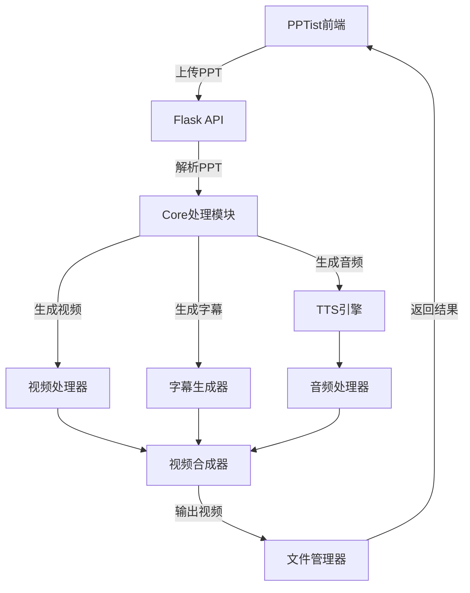

# PPT转视频项目结构文档

## 项目概述

本项目是一个完整的PPT转视频工作流系统，包含前端PPTist编辑器和后端Flask API服务。

## 整体架构

```
ppt_to_video/
├── PPTist/                    # 前端Vue.js应用 - PPT编辑器
├── flask_backend/             # 后端Flask API服务
├── config_data/              # 全局配置数据
├── docs/                     # 项目文档
├── deploy/                   # 部署脚本
├── logs/                     # 日志文件
├── output/                   # 输出文件
├── temp/                     # 临时文件
├── uploads/                  # 上传文件
├── .github/                  # GitHub配置
└── README.md                 # 项目说明
```

## 前端架构 - PPTist

### 技术栈
- **框架**: Vue 3 + TypeScript
- **构建工具**: Vite
- **UI库**: Element Plus
- **状态管理**: Pinia
- **路由**: Vue Router
- **样式**: SCSS

### 目录结构
```
PPTist/
├── src/
│   ├── api/                  # API接口定义
│   │   ├── base.ts           # 基础API配置
│   │   ├── types/            # API类型定义
│   │   └── services/         # API服务模块
│   │       ├── aiService.ts  # AI服务接口
│   │       └── configService.ts # 配置服务接口
│   ├── components/           # 公共组件
│   │   ├── Canvas/           # 画布相关组件
│   │   ├── Editor/           # 编辑器组件
│   │   ├── Toolbar/          # 工具栏组件
│   │   └── AIConfigPanel/    # AI配置面板
│   ├── views/                # 页面组件
│   │   ├── Editor/           # 编辑器页面
│   │   ├── Screen/           # 演示页面
│   │   └── Mobile/           # 移动端页面
│   ├── stores/               # 状态管理
│   │   ├── editor.ts         # 编辑器状态
│   │   ├── slides.ts         # 幻灯片状态
│   │   └── ai.ts             # AI配置状态
│   ├── utils/                # 工具函数
│   │   ├── canvas.ts         # 画布工具
│   │   ├── export.ts         # 导出功能
│   │   └── prosemirror.ts    # 富文本编辑
│   ├── hooks/                # 组合式函数
│   │   ├── useCanvas.ts      # 画布钩子
│   │   ├── useKeyboard.ts    # 键盘事件
│   │   └── useSlide.ts       # 幻灯片操作
│   ├── configs/              # 配置文件
│   │   ├── element.ts        # 元素配置
│   │   ├── font.ts           # 字体配置
│   │   └── images.ts         # 图片配置
│   └── types/                # TypeScript类型定义
├── public/                   # 静态资源
├── doc/                      # 开发文档
├── package.json              # 依赖配置
├── vite.config.ts            # Vite配置
└── tsconfig.json             # TypeScript配置
```

### 核心功能模块
1. **编辑器核心** (`src/views/Editor/`)
   - 幻灯片编辑
   - 元素操作
   - 样式设置
   - 动画配置

2. **画布渲染** (`src/components/Canvas/`)
   - 画布绘制
   - 交互处理
   - 缩放适配

3. **AI集成** (`src/api/services/aiService.ts`)
   - AI配置管理
   - 智能内容生成
   - 配置验证

## 后端架构 - Flask Backend

### 技术栈
- **框架**: Flask
- **数据库**: SQLite (配置存储)
- **异步处理**: asyncio
- **文件处理**: python-pptx, moviepy
- **AI集成**: OpenAI API, Azure Cognitive Services
- **音频处理**: librosa, pydub

### 目录结构
```
flask_backend/
├── core/                     # 核心业务逻辑
│   ├── step01_ppt_parser.py  # PPT解析器
│   ├── step02_tts_generator.py # 语音合成
│   ├── step03_video_generator.py # 视频生成
│   ├── step04_subtitle_generator.py # 字幕生成
│   ├── step05_final_merger.py # 最终合并
│   ├── task4_3_advanced_audio_processor.py # 高级音频处理
│   ├── videolingo_integrator.py # VideoLingo集成
│   ├── workflow_persistence.py # 工作流持久化
│   ├── ai_content_optimizer.py # AI内容优化
│   └── project_manager.py    # 项目管理
├── api/                      # API路由
│   ├── __init__.py
│   ├── routes/               # 路由定义
│   │   ├── config.py         # 配置API
│   │   ├── workflow.py       # 工作流API
│   │   ├── upload.py         # 文件上传API
│   │   └── ai.py             # AI服务API
│   └── middleware/           # 中间件
│       ├── auth.py           # 认证中间件
│       ├── cors.py           # CORS处理
│       └── error_handler.py  # 错误处理
├── utils/                    # 工具模块
│   ├── config_manager.py     # 配置管理
│   ├── file_manager.py       # 文件管理
│   ├── logger.py             # 日志工具
│   ├── progress_tracker.py   # 进度跟踪
│   ├── task_manager.py       # 任务管理
│   └── integrated_tts_manager.py # TTS管理
├── config/                   # 配置文件
│   ├── app_config.py         # 应用配置
│   ├── ai_config.py          # AI配置
│   └── workflow_config.py    # 工作流配置
├── app/                      # Flask应用
│   ├── __init__.py           # 应用工厂
│   ├── models/               # 数据模型
│   └── schemas/              # 数据验证模式
├── config_data/              # 配置数据存储
│   ├── storage/              # 数据库文件
│   └── backups/              # 配置备份
├── output/                   # 输出文件
│   ├── slides/               # 幻灯片图片
│   ├── audios/               # 音频文件
│   ├── subtitles/            # 字幕文件
│   └── videos/               # 最终视频
├── logs/                     # 日志文件
├── app.py                    # 主应用入口
└── requirements.txt          # Python依赖
```

### 核心工作流模块

#### 1. PPT处理流程 (`core/step01_*.py`)
- **PPT解析**: 提取文本、图片、布局信息
- **内容处理**: 文本清理、格式转换
- **图片导出**: 幻灯片转换为图片

#### 2. 语音合成 (`core/step02_tts_generator.py`)
- **多引擎支持**: Edge TTS, Azure TTS, OpenAI TTS
- **语音配置**: 语言、语速、音调设置
- **批量处理**: 多文本并行合成

#### 3. 视频生成 (`core/step03_video_generator.py`)
- **图片序列**: 幻灯片图片转视频
- **音频同步**: 音频与视频时长匹配
- **转场效果**: 幻灯片间转换动画

#### 4. 字幕处理 (`core/step04_subtitle_generator.py`)
- **字幕生成**: 基于音频时长生成SRT
- **样式配置**: 字体、颜色、位置设置
- **智能分割**: AI辅助文本分割

#### 5. 高级音频处理 (`core/task4_3_advanced_audio_processor.py`)
- **噪音降噪**: 背景噪音消除
- **音质增强**: 音频质量优化
- **音量归一化**: 统一音量级别
- **音频分析**: 频谱分析、情感检测

### API接口设计

#### 配置管理API (`/api/config`)
- `GET /config/ai` - 获取AI配置
- `POST /config/ai` - 更新AI配置
- `GET /config/workflow` - 获取工作流配置
- `POST /config/validate` - 验证配置

#### 工作流API (`/api/workflow`)
- `POST /workflow/start` - 启动工作流
- `GET /workflow/status/{id}` - 获取进度状态
- `POST /workflow/pause` - 暂停工作流
- `DELETE /workflow/cancel/{id}` - 取消任务

#### 文件上传API (`/api/upload`)
- `POST /upload/ppt` - 上传PPT文件
- `POST /upload/image` - 上传图片
- `GET /download/{file_id}` - 下载文件

## 数据流架构



## 配置文件结构

### 全局配置 (`config_data/`)
```
config_data/
├── app_config_template.json  # 应用配置模板
├── ai_configs.json          # AI服务配置
├── tts_config.json          # TTS配置
├── workflow_config.json     # 工作流配置
└── storage/
    ├── videolingo_configs.db # VideoLingo配置数据库
    └── backups/             # 配置备份
```

### 前端环境配置
```
PPTist/
├── .env.development         # 开发环境配置
├── .env.production         # 生产环境配置
└── .env.local              # 本地配置
```

## 部署架构

### 开发环境
- 前端: `npm run dev` (localhost:5173)
- 后端: `python app.py` (localhost:5000)

### 生产环境
- 前端: Nginx + 静态文件
- 后端: Gunicorn + Flask
- 数据库: SQLite (可扩展至PostgreSQL)

## 扩展点

1. **AI服务扩展**: 支持更多AI提供商
2. **TTS引擎扩展**: 集成更多语音合成服务
3. **视频效果扩展**: 添加更多转场和特效
4. **数据库升级**: 从SQLite迁移至PostgreSQL
5. **微服务架构**: 将核心模块拆分为独立服务

## 性能优化

1. **异步处理**: 使用asyncio处理长时间任务
2. **缓存机制**: Redis缓存频繁访问的数据
3. **文件压缩**: 优化音视频文件大小
4. **并发处理**: 多线程处理批量任务
5. **CDN部署**: 静态资源CDN加速

---

更新时间: 2025年9月11日
版本: v1.0.0
