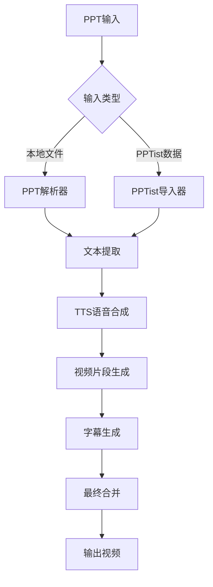

# PPT转视频工具 🎬

<div align="center">


**一站式PPT转视频教程生成平台**

支持PPTist在线编辑器集成 | 多引擎TTS语音合成 | 自动化视频生成 | 智能字幕同步

[快速开始](#快速开始) • [功能特性](#功能特性) • [项目架构](#项目架构) • [API文档](#api接口) • [部署指南](#部署指南)

</div>

---

## 🌟 功能特性

### 📋 PPT处理
- � **PPTist集成**: 无缝对接PPTist在线编辑器，一键导入PPT数据
- 📄 **多格式支持**: 支持.pptx文件上传和PPTist JSON数据导入
- 🖼️ **内容解析**: 自动提取PPT文本、图片、样式等元素
- 📐 **布局保持**: 保持原始PPT的页面布局和设计风格

### 🎙️ 多引擎TTS语音合成
- 🌐 **Edge TTS**: 微软高质量语音合成，支持多种中英文音色
- 🐟 **Fish TTS**: SiliconFlow平台Fish语音合成服务
- 🤖 **OpenAI TTS**: OpenAI官方语音合成API
- ☁️ **Azure TTS**: 微软Azure认知服务语音合成
- � **GPT-SoVITS**: 高质量AI语音克隆技术
- ⚙️ **自定义TTS**: 支持自定义TTS引擎接入

### 🎬 智能视频生成
- 🎭 **自适应布局**: 根据PPT内容自动调整视频布局
- ⏱️ **时长预估**: 智能预估每页PPT的最佳展示时长
- 🎨 **视觉效果**: 支持页面切换动画和视觉增强
- 📱 **多分辨率**: 支持1080p、720p等多种输出分辨率

### 📝 字幕处理系统
- 🕐 **精准同步**: 基于语音时长的精确字幕时间轴匹配
- 🎨 **样式定制**: 支持字幕字体、颜色、位置等样式设置
- � **格式支持**: 输出SRT、VTT等标准字幕格式
- 🔧 **手动调优**: 提供字幕时间轴手动调整功能

### �🔄 工作流管理
- ⚡ **断点续传**: 支持任务中断后从断点继续执行
- 📊 **进度跟踪**: 实时显示各步骤执行进度和状态
- 💾 **状态保存**: 自动保存工作流状态和中间结果
- 🔄 **重试机制**: 自动重试失败的步骤，提高成功率

### 🌐 用户界面
- 📱 **响应式设计**: 支持桌面和移动设备访问
- 🎛️ **直观操作**: 简洁友好的Web界面，易于上手
- 📈 **实时反馈**: 实时显示处理进度和结果预览
- 🎨 **现代UI**: 基于Streamlit的现代化界面设计

## 🚀 快速开始

### 1️⃣ 环境要求
```bash
# 系统要求
Python 3.12+
Windows 10/11 或 macOS 或 Linux
至少4GB内存，推荐8GB+

# 可选依赖
FFmpeg (用于高级视频处理)
```

### 2️⃣ 安装部署
```bash
# 克隆项目
git clone https://github.com/huguanjin/PPT-TO-VIDEO.git
cd PPT-TO-VIDEO

# 创建虚拟环境
python -m venv venv

# 激活虚拟环境
# Windows PowerShell
venv\Scripts\Activate.ps1
# Windows CMD
venv\Scripts\activate.bat
# Linux/macOS
source venv/bin/activate

# 安装依赖
pip install -r requirements.txt
```

### 3️⃣ 启动服务
```bash
# 方式一：使用启动脚本（推荐）
# Windows
start_dev.bat
# Linux/macOS
./start_all.sh

# 方式二：手动启动
# 启动完整工作流API服务器
uvicorn api_full_workflow:app --host 0.0.0.0 --port 8502 --reload

# 启动PPTist前端（新终端）
cd PPTist && npm run dev
```

### 4️⃣ 使用流程
1. 🌐 **访问界面**: 打开浏览器访问PPTist编辑器 `http://localhost:5173`
2. 📁 **导入PPT**: 支持两种方式：
   - 上传本地.pptx文件到PPTist编辑器
   - 直接在PPTist中创建演示文稿
3. ⚙️ **配置参数**: 在PPTist中点击"导出视频"按钮，配置TTS引擎、语音、视频设置等
4. 🎬 **生成视频**: 执行自动化工作流，实时跟踪进度
5. 📥 **下载结果**: 预览并下载生成的视频和字幕文件

## 🏗️ 项目架构

### 📁 目录结构
```
ppt_to_video/
├── 🔄 api_full_workflow.py      # 完整工作流API服务器（主入口）
├── 🌐 api_simple.py             # 简化版API服务器（仅测试用）
├── 🔄 api_full_workflow.py      # 完整工作流API
├── 📦 api_ppt_storage.py        # PPT存储管理API
├── 🔗 api_pptist_import.py      # PPTist集成API
├── 🚀 start_dev.bat             # 开发环境启动脚本
├── 📋 requirements.txt          # Python依赖列表
├── 📚 README.md                 # 项目文档
├── 📚 README_EN.md              # 英文文档
│
├── 📂 config/                   # 配置模块
│   ├── 🔧 settings.py           # 全局设置
│   ├── 📝 logging_config.py     # 日志配置
│   └── 📊 app_config.json       # 应用配置文件
│
├── 🎯 core/                     # 核心业务逻辑
│   ├── 📄 step01_pptist_importer.py    # PPTist数据导入
│   ├── 📊 step01_ppt_parser.py         # PPT文件解析
│   ├── 🎙️ step02_tts_generator.py      # TTS语音生成
│   ├── 🎬 step03_video_generator.py    # 视频生成
│   ├── 📝 step04_subtitle_generator.py # 字幕生成
│   └── 🔗 step05_final_merger.py       # 最终合并
│
├── 🛠️ utils/                    # 工具模块
│   ├── ⚙️ config_manager.py     # 配置管理器
│   ├── 📁 file_manager.py       # 文件管理器
│   ├── 🎙️ integrated_tts_manager.py # 集成TTS管理
│   ├── 📝 logger.py             # 日志工具
│   ├── 📊 progress_tracker.py   # 进度跟踪器
│   └── 🔄 task_manager.py       # 任务管理器
│
├── 🎨 ui/                       # UI组件
│   └── 📄 pages/                # Streamlit页面组件
│
├── 🎤 all_tts_functions/        # TTS引擎集合
│   ├── 🌐 edge_tts.py           # Edge TTS
│   ├── 🐟 fish_tts.py           # Fish TTS
│   ├── 🤖 openai_tts.py         # OpenAI TTS
│   ├── ☁️ azure_tts.py          # Azure TTS
│   ├── 🎯 gpt_sovits_tts.py     # GPT-SoVITS
│   └── ⚙️ custom_tts.py         # 自定义TTS
│
├── 🧪 tests/                    # 测试文件
│   └── 🔍 test_ppt_parser.py    # PPT解析器测试
│
├── 📁 testfile/                 # 测试资源
│   ├── 📄 测试文件.pptx         # 测试PPT文件
│   ├── 📊 ppt测试.json          # 测试配置
│   └── 🖼️ ppt测试.jpeg          # 测试图片
│
├── 📤 output/                   # 输出目录
│   └── 📁 [project_folders]/    # 项目输出文件夹
│
└── 📁 PPTist/                   # PPTist前端集成
    ├── 📄 src/components/       # Vue组件
    ├── ⚙️ .env.development       # 环境配置
    └── 📦 package.json          # 前端依赖
```

### 🔄 工作流架构


## 🔌 API接口

### 🌐 完整工作流API (api_full_workflow.py)
**端口**: `8502` （主要服务）

| 接口 | 方法 | 描述 |
|------|------|------|
| `/health` | GET | 服务健康检查 |
| `/api/ppt/list` | GET | 获取PPT项目列表 |
| `/api/workflow/execute` | POST | 执行完整工作流 |
| `/api/workflow/status/{workflow_id}` | GET | 查询工作流状态 |
| `/api/workflow/result/{workflow_id}` | GET | 获取工作流结果 |

### 🌐 简化API服务 (api_simple.py)
**端口**: `8002` （测试用）

| 接口 | 方法 | 描述 |
|------|------|------|
| `/health` | GET | 服务健康检查 |
| `/api/ppt/list` | GET | 获取PPT项目列表 |
| `/api/workflow/execute` | POST | 模拟工作流执行（仅返回模拟响应） |

### 🔄 完整工作流API (api_full_workflow.py)
**端口**: `8003` （备用端口）

| 接口 | 方法 | 描述 |
|------|------|------|
| `/api/workflow/start` | POST | 启动工作流 |
| `/api/workflow/status/{task_id}` | GET | 查询任务状态 |
| `/api/workflow/result/{task_id}` | GET | 获取任务结果 |

### 🔗 PPTist集成API (api_pptist_import.py)
**端口**: `8001`

| 接口 | 方法 | 描述 |
|------|------|------|
| `/api/pptist/import` | POST | 导入PPTist数据 |
| `/api/pptist/projects` | GET | 获取项目列表 |

## 🔧 配置说明

### 🎙️ TTS配置 (config_data/tts_config.json)
```json
{
  "edge_tts": {
    "voice": "zh-CN-XiaoxiaoNeural",
    "rate": "+0%",
    "pitch": "+0Hz"
  },
  "fish_tts": {
    "api_key": "your_api_key",
    "model": "fish-speech-1"
  },
  "openai_tts": {
    "api_key": "your_api_key",
    "model": "tts-1",
    "voice": "alloy"
  }
}
```

### 📱 应用配置 (config_data/app_config.json)
```json
{
  "app": {
    "title": "PPT转视频工具",
    "version": "2.0.0",
    "debug": false
  },
  "video": {
    "resolution": "1920x1080",
    "fps": 30,
    "quality": "high"
  },
  "subtitle": {
    "font_size": 20,
    "font_color": "white",
    "position": "bottom"
  }
}
```

## 🚀 部署指南

### 🖥️ 本地开发部署
```bash
# 1. 克隆并设置项目
git clone https://github.com/huguanjin/PPT-TO-VIDEO.git
cd PPT-TO-VIDEO

# 2. 创建并激活虚拟环境
python -m venv venv
venv\Scripts\Activate.ps1  # Windows

# 3. 安装依赖
pip install -r requirements.txt

# 4. 启动开发服务
start_dev.bat  # Windows
```

### 🐋 Docker部署
```dockerfile
# Dockerfile
FROM python:3.12-slim

WORKDIR /app
COPY requirements.txt .
RUN pip install -r requirements.txt

COPY . .
EXPOSE 8501 8002

CMD ["./start_all.sh"]
```

```bash
# 构建和运行
docker build -t ppt-to-video .
docker run -p 8501:8501 -p 8002:8002 ppt-to-video
```

### ☁️ 云服务器部署
```bash
# 1. 服务器环境准备
sudo apt update
sudo apt install python3 python3-pip python3-venv

# 2. 项目部署
git clone https://github.com/huguanjin/PPT-TO-VIDEO.git
cd PPT-TO-VIDEO
python3 -m venv venv
source venv/bin/activate
pip install -r requirements.txt

# 3. 使用进程管理器
pip install supervisor
# 配置supervisor管理服务进程
```

## 🔧 技术栈

### 后端技术
- **Python 3.12+**: 核心开发语言
- **FastAPI**: 高性能API框架
- **Uvicorn**: ASGI服务器
- **Pydantic**: 数据验证和序列化
- **asyncio**: 异步编程支持

### PPT处理
- **python-pptx**: PPT文件解析
- **Pillow (PIL)**: 图像处理
- **openpyxl**: Excel文件处理

### 语音合成
- **edge-tts**: 微软Edge语音合成
- **requests**: HTTP客户端
- **aiohttp**: 异步HTTP客户端

### 视频处理
- **moviepy**: 视频编辑处理
- **opencv-python**: 计算机视觉
- **numpy**: 数值计算

### 字幕处理
- **pysrt**: SRT字幕文件处理
- **webvtt-py**: VTT字幕文件处理

### 前端集成
- **Vue.js 3**: 前端框架（PPTist集成）
- **TypeScript**: 类型安全的JavaScript
- **Vite**: 前端构建工具

## 📊 性能指标

### 🏃‍♂️ 处理速度
- **PPT解析**: ~2秒/页
- **TTS合成**: ~1秒/100字符
- **视频生成**: ~5秒/页（1080p）
- **字幕同步**: ~0.5秒/页

### 💾 系统要求
- **最低配置**: 4GB RAM, 2核CPU
- **推荐配置**: 8GB+ RAM, 4核+ CPU
- **存储空间**: 项目大小约500MB，输出根据内容而定

### 📈 扩展性
- 支持并发处理多个项目
- 模块化设计便于功能扩展
- 支持分布式部署

## 🛠️ 开发指南

### 🔧 添加新的TTS引擎
1. 在 `all_tts_functions/` 目录创建新的TTS模块
2. 实现标准的TTS接口
3. 在 `integrated_tts_manager.py` 中注册新引擎
4. 更新配置文件和UI选项

### 📝 自定义字幕样式
1. 修改 `step04_subtitle_generator.py` 中的样式配置
2. 更新 `config_data/app_config.json` 中的字幕设置
3. 在UI中添加相应的控制选项

### 🎨 界面定制
1. 修改 `ui/pages/` 目录下的Streamlit组件
2. 更新 `main.py` 中的页面路由
3. 调整CSS样式和主题配置

## ❓ 常见问题

<details>
<summary><strong>Q: TTS语音合成失败怎么办？</strong></summary>

A: 
1. 检查网络连接是否正常
2. 确认API密钥配置正确
3. 尝试切换到其他TTS引擎
4. 查看日志文件获取详细错误信息
</details>

<details>
<summary><strong>Q: 视频生成质量不满意？</strong></summary>

A:
1. 调整视频分辨率和质量设置
2. 优化PPT内容的图片清晰度
3. 调整每页显示时长
4. 检查字幕位置和样式设置
</details>

<details>
<summary><strong>Q: 支持哪些PPT格式？</strong></summary>

A: 
- ✅ .pptx (推荐)
- ✅ PPTist JSON数据
- ❌ .ppt (旧版本，需要转换)
- ❌ .pdf (不支持，需要转换)
</details>

<details>
<summary><strong>Q: 如何提高处理速度？</strong></summary>

A:
1. 使用SSD硬盘提高IO性能
2. 增加系统内存
3. 选择性能更好的TTS引擎
4. 优化PPT内容复杂度
</details>

## 🤝 贡献指南

我们欢迎所有形式的贡献！

### 🐛 报告问题
- 使用GitHub Issues报告bug
- 提供详细的问题描述和复现步骤
- 附上相关的日志文件

### 💡 功能建议
- 在Issues中标记为"enhancement"
- 详细描述新功能的需求和用例
- 讨论实现方案的可行性

### 🔧 代码贡献
1. Fork项目到你的GitHub账户
2. 创建功能分支: `git checkout -b feature/amazing-feature`
3. 提交更改: `git commit -m 'Add amazing feature'`
4. 推送分支: `git push origin feature/amazing-feature`
5. 创建Pull Request

### 📝 文档贡献
- 改进README文档
- 添加API文档
- 完善代码注释
- 翻译多语言版本

## 📄 许可证

本项目采用 MIT 许可证。详情请参阅 [LICENSE](LICENSE) 文件。

## 👥 维护团队

- **主要维护者**: [huguanjin](https://github.com/huguanjin)
- **贡献者**: 查看 [Contributors](https://github.com/huguanjin/PPT-TO-VIDEO/contributors)

## 🙏 致谢

感谢以下开源项目的支持：
- [FastAPI](https://fastapi.tiangolo.com/) - 现代化API框架
- [Vue.js](https://vuejs.org/) - 渐进式JavaScript框架
- [python-pptx](https://python-pptx.readthedocs.io/) - PPT文件处理
- [MoviePy](https://zulko.github.io/moviepy/) - 视频编辑库
- [Edge-TTS](https://github.com/rany2/edge-tts) - 微软语音合成

## 📞 联系我们

- 📧 邮箱: your-email@example.com
- 💬 讨论群: [加入我们的社区](https://your-community-link)
- 🐦 Twitter: [@your-twitter](https://twitter.com/your-twitter)
- 📝 博客: [项目博客](https://your-blog-link)

---

<div align="center">

**⭐ 如果这个项目对你有帮助，请给我们一个星标！⭐**

</div>
