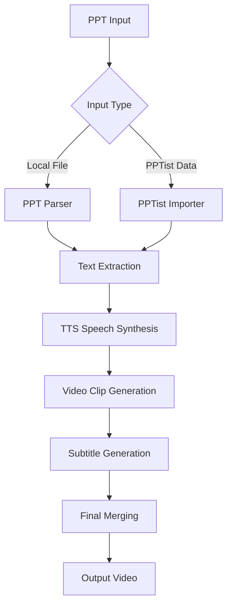

# PPT to Video Tool 🎬

<div align="center">


**One-Stop PPT to Video Tutorial Generation Platform**

PPTist Online Editor Integration | Multi-Engine TTS Synthesis | Automated Video Generation | Intelligent Subtitle Synchronization

[Quick Start](#quick-start) • [Features](#features) • [Architecture](#project-architecture) • [API Documentation](#api-endpoints) • [Deployment](#deployment-guide)

</div>

---

## 🌟 Features

### 📋 PPT Processing
- 🔗 **PPTist Integration**: Seamless integration with PPTist online editor, one-click PPT data import
- 📄 **Multi-format Support**: Support for .pptx file upload and PPTist JSON data import
- 🖼️ **Content Parsing**: Automatic extraction of PPT text, images, styles and other elements
- 📐 **Layout Preservation**: Maintains original PPT page layout and design style

### 🎙️ Multi-Engine TTS Speech Synthesis
- 🌐 **Edge TTS**: Microsoft high-quality speech synthesis with multiple Chinese and English voices
- 🐟 **Fish TTS**: SiliconFlow platform Fish speech synthesis service
- 🤖 **OpenAI TTS**: OpenAI official speech synthesis API
- ☁️ **Azure TTS**: Microsoft Azure Cognitive Services speech synthesis
- 🎯 **GPT-SoVITS**: High-quality AI voice cloning technology
- ⚙️ **Custom TTS**: Support for custom TTS engine integration

### 🎬 Smart Video Generation
- 🎭 **Adaptive Layout**: Automatically adjusts video layout based on PPT content
- ⏱️ **Duration Estimation**: Intelligently estimates optimal display duration for each PPT page
- 🎨 **Visual Effects**: Support for page transition animations and visual enhancements
- 📱 **Multi-Resolution**: Support for 1080p, 720p and other output resolutions

### 📝 Subtitle Processing System
- 🕐 **Precise Synchronization**: Accurate subtitle timeline matching based on speech duration
- 🎨 **Style Customization**: Support for subtitle font, color, position and other style settings
- 📄 **Format Support**: Output standard subtitle formats like SRT, VTT
- 🔧 **Manual Optimization**: Provides manual subtitle timeline adjustment functionality

### 🔄 Workflow Management
- ⚡ **Resume from Breakpoint**: Support for resuming execution from breakpoint after task interruption
- 📊 **Progress Tracking**: Real-time display of execution progress and status for each step
- 💾 **State Saving**: Automatic saving of workflow state and intermediate results
- 🔄 **Retry Mechanism**: Automatic retry of failed steps to improve success rate

### 🌐 User Interface
- 📱 **Responsive Design**: Support for desktop and mobile device access
- 🎛️ **Intuitive Operation**: Clean and friendly web interface, easy to get started
- 📈 **Real-time Feedback**: Real-time display of processing progress and result preview
- 🎨 **Modern UI**: Modern interface design based on Streamlit

## 🚀 Quick Start

### 1️⃣ Environment Requirements
```bash
# System Requirements
Python 3.12+
Windows 10/11 or macOS or Linux
At least 4GB RAM, 8GB+ recommended

# Optional Dependencies
FFmpeg (for advanced video processing)
```

### 2️⃣ Installation & Deployment
```bash
# Clone the project
git clone https://github.com/huguanjin/PPT-TO-VIDEO.git
cd PPT-TO-VIDEO

# Create virtual environment
python -m venv venv

# Activate virtual environment
# Windows PowerShell
venv\Scripts\Activate.ps1
# Windows CMD
venv\Scripts\activate.bat
# Linux/macOS
source venv/bin/activate

# Install dependencies
pip install -r requirements.txt
```

### 3️⃣ Start Services
```bash
# Method 1: Use startup script (Recommended)
# Windows
start_dev.bat
# Linux/macOS
./start_all.sh

# Method 2: Manual startup
# Start main API server
uvicorn api_simple:app --host 0.0.0.0 --port 8002 --reload

# Start PPTist frontend (new terminal)
cd PPTist && npm run dev
```

### 4️⃣ Usage Workflow
1. 🌐 **Access Interface**: Open browser and visit PPTist editor `http://localhost:5173`
2. 📁 **Import PPT**: Two methods supported:
   - Upload local .pptx file to PPTist editor
   - Create presentation directly in PPTist
3. ⚙️ **Configure Parameters**: Click "Export Video" button in PPTist, configure TTS engine, voice, video settings, etc.
4. 🎬 **Generate Video**: Execute automated workflow with real-time progress tracking
5. 📥 **Download Results**: Preview and download generated video and subtitle files

## 🏗️ Project Architecture

### 📁 Directory Structure
```
ppt_to_video/
├── 🌐 api_simple.py             # Main API server entry point
├── 🔄 api_full_workflow.py      # Complete workflow API server
├── 🔄 api_full_workflow.py      # Complete workflow API
├── 📦 api_ppt_storage.py        # PPT storage management API
├── 🔗 api_pptist_import.py      # PPTist integration API
├── 🚀 start_dev.bat             # Development environment startup script
├── 📋 requirements.txt          # Python dependency list
├── 📚 README.md                 # Project documentation (Chinese)
├── 📚 README_EN.md              # English documentation
│
├── 📂 config/                   # Configuration module
│   ├── 🔧 settings.py           # Global settings
│   ├── 📝 logging_config.py     # Logging configuration
│   └── 📊 app_config.json       # Application configuration file
│
├── 🎯 core/                     # Core business logic
│   ├── 📄 step01_pptist_importer.py    # PPTist data import
│   ├── 📊 step01_ppt_parser.py         # PPT file parsing
│   ├── 🎙️ step02_tts_generator.py      # TTS speech generation
│   ├── 🎬 step03_video_generator.py    # Video generation
│   ├── 📝 step04_subtitle_generator.py # Subtitle generation
│   └── 🔗 step05_final_merger.py       # Final merging
│
├── 🛠️ utils/                    # Utility modules
│   ├── ⚙️ config_manager.py     # Configuration manager
│   ├── 📁 file_manager.py       # File manager
│   ├── 🎙️ integrated_tts_manager.py # Integrated TTS management
│   ├── 📝 logger.py             # Logging utility
│   ├── 📊 progress_tracker.py   # Progress tracker
│   └── 🔄 task_manager.py       # Task manager
│
├── 🎨 ui/                       # UI components
│   └── 📄 pages/                # Streamlit page components
│
├── 🎤 all_tts_functions/        # TTS engine collection
│   ├── 🌐 edge_tts.py           # Edge TTS
│   ├── 🐟 fish_tts.py           # Fish TTS
│   ├── 🤖 openai_tts.py         # OpenAI TTS
│   ├── ☁️ azure_tts.py          # Azure TTS
│   ├── 🎯 gpt_sovits_tts.py     # GPT-SoVITS
│   └── ⚙️ custom_tts.py         # Custom TTS
│
├── 🧪 tests/                    # Test files
│   └── 🔍 test_ppt_parser.py    # PPT parser tests
│
├── 📁 testfile/                 # Test resources
│   ├── 📄 测试文件.pptx         # Test PPT file
│   ├── 📊 ppt测试.json          # Test configuration
│   └── 🖼️ ppt测试.jpeg          # Test image
│
├── 📤 output/                   # Output directory
│   └── 📁 [project_folders]/    # Project output folders
│
└── 📁 PPTist/                   # PPTist frontend integration
    ├── 📄 src/components/       # Vue components
    ├── ⚙️ .env.development       # Environment configuration
    └── 📦 package.json          # Frontend dependencies
```

### 🔄 Workflow Architecture


## 🔌 API Endpoints

### 🌐 Simplified API Service (api_simple.py)
**Port**: `8002`

| Endpoint | Method | Description |
|----------|--------|-------------|
| `/health` | GET | Service health check |
| `/api/ppt/list` | GET | Get PPT project list |
| `/api/workflow/execute` | POST | Execute complete workflow |

### 🔄 Complete Workflow API (api_full_workflow.py)
**Port**: `8003`

| Endpoint | Method | Description |
|----------|--------|-------------|
| `/api/workflow/start` | POST | Start workflow |
| `/api/workflow/status/{task_id}` | GET | Query task status |
| `/api/workflow/result/{task_id}` | GET | Get task result |

### 🔗 PPTist Integration API (api_pptist_import.py)
**Port**: `8001`

| Endpoint | Method | Description |
|----------|--------|-------------|
| `/api/pptist/import` | POST | Import PPTist data |
| `/api/pptist/projects` | GET | Get project list |

## 🔧 Configuration

### 🎙️ TTS Configuration (config_data/tts_config.json)
```json
{
  "edge_tts": {
    "voice": "en-US-JennyNeural",
    "rate": "+0%",
    "pitch": "+0Hz"
  },
  "fish_tts": {
    "api_key": "your_api_key",
    "model": "fish-speech-1"
  },
  "openai_tts": {
    "api_key": "your_api_key",
    "model": "tts-1",
    "voice": "alloy"
  }
}
```

### 📱 Application Configuration (config_data/app_config.json)
```json
{
  "app": {
    "title": "PPT to Video Tool",
    "version": "2.0.0",
    "debug": false
  },
  "video": {
    "resolution": "1920x1080",
    "fps": 30,
    "quality": "high"
  },
  "subtitle": {
    "font_size": 20,
    "font_color": "white",
    "position": "bottom"
  }
}
```

## 🚀 Deployment Guide

### 🖥️ Local Development Deployment
```bash
# 1. Clone and setup project
git clone https://github.com/huguanjin/PPT-TO-VIDEO.git
cd PPT-TO-VIDEO

# 2. Create and activate virtual environment
python -m venv venv
venv\Scripts\Activate.ps1  # Windows

# 3. Install dependencies
pip install -r requirements.txt

# 4. Start development services
start_dev.bat  # Windows
```

### 🐋 Docker Deployment
```dockerfile
# Dockerfile
FROM python:3.12-slim

WORKDIR /app
COPY requirements.txt .
RUN pip install -r requirements.txt

COPY . .
EXPOSE 8501 8002

CMD ["./start_all.sh"]
```

```bash
# Build and run
docker build -t ppt-to-video .
docker run -p 8501:8501 -p 8002:8002 ppt-to-video
```

### ☁️ Cloud Server Deployment
```bash
# 1. Server environment preparation
sudo apt update
sudo apt install python3 python3-pip python3-venv

# 2. Project deployment
git clone https://github.com/your-username/ppt-to-video.git
cd ppt-to-video
python3 -m venv venv
source venv/bin/activate
pip install -r requirements.txt

# 3. Use process manager
pip install supervisor
# Configure supervisor to manage service processes
```

## 🔧 Technology Stack

### Backend Technologies
- **Python 3.12+**: Core development language
- **FastAPI**: High-performance API framework
- **Uvicorn**: ASGI server
- **Pydantic**: Data validation and serialization
- **asyncio**: Asynchronous programming support

### PPT Processing
- **python-pptx**: PPT file parsing
- **Pillow (PIL)**: Image processing
- **openpyxl**: Excel file processing

### Speech Synthesis
- **edge-tts**: Microsoft Edge speech synthesis
- **requests**: HTTP client
- **aiohttp**: Asynchronous HTTP client

### Video Processing
- **moviepy**: Video editing and processing
- **opencv-python**: Computer vision
- **numpy**: Numerical computing

### Subtitle Processing
- **pysrt**: SRT subtitle file processing
- **webvtt-py**: VTT subtitle file processing

### Frontend Integration
- **Vue.js 3**: Frontend framework (PPTist integration)
- **TypeScript**: Type-safe JavaScript
- **Vite**: Frontend build tool

## 📊 Performance Metrics

### 🏃‍♂️ Processing Speed
- **PPT Parsing**: ~2 seconds/page
- **TTS Synthesis**: ~1 second/100 characters
- **Video Generation**: ~5 seconds/page (1080p)
- **Subtitle Sync**: ~0.5 seconds/page

### 💾 System Requirements
- **Minimum**: 4GB RAM, 2-core CPU
- **Recommended**: 8GB+ RAM, 4+ core CPU
- **Storage**: Project size ~500MB, output varies by content

### 📈 Scalability
- Supports concurrent processing of multiple projects
- Modular design facilitates feature extension
- Supports distributed deployment

## 🛠️ Development Guide

### 🔧 Adding New TTS Engine
1. Create new TTS module in `all_tts_functions/` directory
2. Implement standard TTS interface
3. Register new engine in `integrated_tts_manager.py`
4. Update configuration files and UI options

### 📝 Custom Subtitle Styles
1. Modify style configuration in `step04_subtitle_generator.py`
2. Update subtitle settings in `config_data/app_config.json`
3. Add corresponding control options in UI

### 🎨 Interface Customization
1. Modify Streamlit components in `ui/pages/` directory
2. Update page routing in `main.py`
3. Adjust CSS styles and theme configuration

## ❓ FAQ

<details>
<summary><strong>Q: What to do if TTS speech synthesis fails?</strong></summary>

A: 
1. Check if network connection is normal
2. Confirm API key configuration is correct
3. Try switching to other TTS engines
4. Check log files for detailed error information
</details>

<details>
<summary><strong>Q: Not satisfied with video generation quality?</strong></summary>

A:
1. Adjust video resolution and quality settings
2. Optimize image clarity in PPT content
3. Adjust display duration per page
4. Check subtitle position and style settings
</details>

<details>
<summary><strong>Q: What PPT formats are supported?</strong></summary>

A: 
- ✅ .pptx (recommended)
- ✅ PPTist JSON data
- ❌ .ppt (old version, needs conversion)
- ❌ .pdf (not supported, needs conversion)
</details>

<details>
<summary><strong>Q: How to improve processing speed?</strong></summary>

A:
1. Use SSD hard drive to improve IO performance
2. Increase system memory
3. Choose better performing TTS engines
4. Optimize PPT content complexity
</details>

## 🤝 Contributing

We welcome all forms of contributions!

### 🐛 Report Issues
- Use GitHub Issues to report bugs
- Provide detailed problem description and reproduction steps
- Attach relevant log files

### 💡 Feature Suggestions
- Mark as "enhancement" in Issues
- Provide detailed description of new feature requirements and use cases
- Discuss feasibility of implementation approaches

### 🔧 Code Contributions
1. Fork the project to your GitHub account
2. Create feature branch: `git checkout -b feature/amazing-feature`
3. Commit changes: `git commit -m 'Add amazing feature'`
4. Push branch: `git push origin feature/amazing-feature`
5. Create Pull Request

### 📝 Documentation Contributions
- Improve README documentation
- Add API documentation
- Complete code comments
- Translate multi-language versions

## 📄 License

This project is licensed under the MIT License. See the [LICENSE](LICENSE) file for details.

## 👥 Maintenance Team

- **Primary Maintainer**: [huguanjin](https://github.com/huguanjin)
- **Contributors**: See [Contributors](https://github.com/huguanjin/PPT-TO-VIDEO/contributors)

## 🙏 Acknowledgments

Thanks to the following open source projects for their support:
- [FastAPI](https://fastapi.tiangolo.com/) - Modern API framework
- [Vue.js](https://vuejs.org/) - Progressive JavaScript framework
- [python-pptx](https://python-pptx.readthedocs.io/) - PPT file processing
- [MoviePy](https://zulko.github.io/moviepy/) - Video editing library
- [Edge-TTS](https://github.com/rany2/edge-tts) - Microsoft speech synthesis

## 📞 Contact Us

- 📧 Email: your-email@example.com
- 💬 Discussion Group: [Join Our Community](https://your-community-link)
- 🐦 Twitter: [@your-twitter](https://twitter.com/your-twitter)
- 📝 Blog: [Project Blog](https://your-blog-link)

---

<div align="center">

**⭐ If this project helps you, please give us a star! ⭐**

</div>
