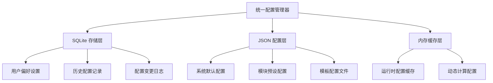

# 后端配置持久化问题深度分析报告

**生成时间**: 2025年9月18日  
**分析范围**: Flask后端配置管理系统  
**重点关注**: 配置重复、硬编码、持久化方案优化  

---

## 1. 🔍 问题发现与分析

### 1.1 配置文件分布混乱

#### 双重配置目录问题
```
项目根目录/config_data/           # 主配置目录
├── app_config.json              # 主应用配置
├── ai_content_understanding_config.json
├── audio_intelligent_sync_config.json
├── subtitle_multiline_fix_config.json
└── ...

flask_backend/config_data/       # 后端专用配置目录
├── app_config.json              # ❌ 重复的应用配置
├── netflix_subtitle_config.json
├── tts_config_optimized.json
└── ...
```

**问题**: 存在两套配置目录，可能导致配置冲突和维护困难。

### 1.2 ❌ 严重的硬编码配置问题

#### step05_final_merger.py 中的 FFmpeg 硬编码配置
```python
# 🚨 硬编码配置 - 无法动态调整
self.ffmpeg_config: Dict[str, str] = {
    "video_codec": "libx264",        # 固定编码器
    "audio_codec": "aac",           # 固定音频编码
    "audio_bitrate": "128k",        # 固定音频码率
    "video_bitrate": "2000k",       # 固定视频码率
    "preset": "medium",             # 固定编码预设
    "crf": "23",                    # 固定质量参数
    "pixel_format": "yuv420p",      # 固定像素格式
    "movflags": "+faststart"        # 固定MOV标志
}
```

**问题影响**:
- ❌ 无法根据硬件性能调整编码参数
- ❌ 无法支持不同质量需求（高质量/快速编码）
- ❌ 无法支持不同输出格式的优化参数
- ❌ 用户无法自定义视频编码设置

#### 其他硬编码配置发现
```python
# step04_subtitle_generator_enhanced.py
self.adaptive_font_size = 18      # 硬编码字体大小
base_font_size = 16               # 硬编码默认字体

# step01_pptist_image_exporter.py  
self.export_config = {...}       # 硬编码导出配置
```

### 1.3 🔄 配置加载器重复问题

#### 发现多个功能重复的配置加载器
```
flask_backend/core/
├── enhanced_config_loader.py        # 增强配置加载器
├── smart_config_loader.py          # 智能配置加载器
├── smart_subtitle_config_loader.py # 智能字幕配置加载器
├── subtitle_config_loader.py       # 字幕配置加载器
├── resolution_adaptive_config.py   # 分辨率自适应配置
└── config_storage.py              # 配置存储管理器
```

**重复功能分析**:
- 多个加载器都实现了相似的配置读取逻辑
- 缺乏统一的配置接口和标准
- 维护成本高，容易出现不一致性

---

## 2. 📊 当前配置管理方式评估

### 2.1 ✅ 现有优势

| 优势 | 描述 | 价值 |
|------|------|------|
| **已有SQLite基础** | config_storage.py 已实现SQLite存储 | 减少开发工作量 |
| **配置分类清晰** | 按功能模块分离配置文件 | 便于管理和维护 |
| **版本控制支持** | 配置文件支持版本管理 | 便于回滚和追踪 |
| **模块化设计** | 各模块独立配置管理 | 降低耦合度 |

### 2.2 ❌ 主要问题

| 问题类型 | 具体问题 | 影响 | 严重程度 |
|----------|----------|------|-----------|
| **配置重复** | 两套config_data目录 | 配置冲突、维护困难 | 🔴 高 |
| **硬编码严重** | FFmpeg等核心参数写死 | 无法动态调整、用户体验差 | 🔴 高 |
| **加载器冗余** | 6个功能重复的配置加载器 | 代码冗余、维护成本高 | 🟡 中 |
| **缺乏统一接口** | 各模块配置方式不一致 | 开发复杂度高 | 🟡 中 |

---

## 3. 🎯 SQLite + 配置文件混合方案设计

### 3.1 架构设计

#### 核心设计理念
```
配置层次化管理:
├── 系统级配置 (SQLite)     # 用户偏好、运行时设置
├── 模块级配置 (JSON)       # 功能模块默认配置
└── 运行时配置 (内存)       # 动态计算的配置
```

#### 技术架构图


### 3.2 具体实现方案

#### 方案1: 分层配置管理
```python
class UnifiedConfigManager:
    """统一配置管理器"""
    
    def __init__(self):
        self.sqlite_storage = ConfigStorageManager()  # 已有的SQLite存储
        self.json_loader = JSONConfigLoader()         # JSON配置加载器
        self.cache = ConfigCache()                    # 内存缓存
    
    def get_config(self, module: str, key: str, default=None):
        """分层获取配置: 用户设置 > 模块配置 > 系统默认"""
        
        # 1. 优先从用户设置获取 (SQLite)
        user_config = self.sqlite_storage.get_user_setting(module, key)
        if user_config is not None:
            return user_config
        
        # 2. 从模块配置获取 (JSON)
        module_config = self.json_loader.get_module_config(module, key)
        if module_config is not None:
            return module_config
            
        # 3. 返回默认值
        return default
    
    def set_config(self, module: str, key: str, value: Any, persist=True):
        """设置配置并选择是否持久化"""
        
        # 更新缓存
        self.cache.set(f"{module}.{key}", value)
        
        # 持久化到SQLite（用户自定义设置）
        if persist:
            self.sqlite_storage.save_user_setting(module, key, value)
```

#### 方案2: 解决FFmpeg硬编码问题
```python
class FFmpegConfigManager:
    """FFmpeg配置管理器"""
    
    def __init__(self, config_manager: UnifiedConfigManager):
        self.config_manager = config_manager
        self._load_ffmpeg_presets()
    
    def get_ffmpeg_config(self, quality_preset="medium", custom_settings=None):
        """动态获取FFmpeg配置"""
        
        # 基础配置从数据库获取
        base_config = self.config_manager.get_config("ffmpeg", "base_settings", {
            "video_codec": "libx264",
            "audio_codec": "aac",
            "pixel_format": "yuv420p",
            "movflags": "+faststart"
        })
        
        # 质量预设配置
        quality_config = self._get_quality_preset(quality_preset)
        
        # 用户自定义配置
        user_config = self.config_manager.get_config("ffmpeg", "user_settings", {})
        
        # 合并配置（优先级：自定义 > 质量预设 > 基础配置）
        final_config = {**base_config, **quality_config, **user_config}
        
        # 应用自定义设置
        if custom_settings:
            final_config.update(custom_settings)
            
        return final_config
    
    def _get_quality_preset(self, preset: str) -> Dict[str, str]:
        """获取质量预设配置"""
        presets = {
            "high_quality": {
                "preset": "slow",
                "crf": "18",
                "video_bitrate": "4000k",
                "audio_bitrate": "192k"
            },
            "medium": {
                "preset": "medium", 
                "crf": "23",
                "video_bitrate": "2000k",
                "audio_bitrate": "128k"
            },
            "fast": {
                "preset": "fast",
                "crf": "26",
                "video_bitrate": "1000k",
                "audio_bitrate": "96k"
            }
        }
        return presets.get(preset, presets["medium"])
```

#### 方案3: 数据库表结构设计
```sql
-- 用户配置表
CREATE TABLE user_configs (
    id INTEGER PRIMARY KEY AUTOINCREMENT,
    module VARCHAR(50) NOT NULL,        -- 模块名 (ffmpeg, subtitle, tts)
    key VARCHAR(100) NOT NULL,          -- 配置键
    value TEXT NOT NULL,                -- 配置值 (JSON格式)
    value_type VARCHAR(20) DEFAULT 'string', -- 值类型
    created_at TIMESTAMP DEFAULT CURRENT_TIMESTAMP,
    updated_at TIMESTAMP DEFAULT CURRENT_TIMESTAMP,
    UNIQUE(module, key)
);

-- 配置预设表
CREATE TABLE config_presets (
    id INTEGER PRIMARY KEY AUTOINCREMENT,
    name VARCHAR(100) NOT NULL,         -- 预设名称
    module VARCHAR(50) NOT NULL,        -- 所属模块
    config_data TEXT NOT NULL,          -- 配置数据 (JSON)
    description TEXT,                   -- 描述
    is_system BOOLEAN DEFAULT FALSE,    -- 是否系统预设
    created_at TIMESTAMP DEFAULT CURRENT_TIMESTAMP
);

-- 配置变更日志表
CREATE TABLE config_changes (
    id INTEGER PRIMARY KEY AUTOINCREMENT,
    module VARCHAR(50) NOT NULL,
    key VARCHAR(100) NOT NULL,
    old_value TEXT,
    new_value TEXT,
    change_reason VARCHAR(200),
    changed_at TIMESTAMP DEFAULT CURRENT_TIMESTAMP
);
```

---

## 4. 🚀 实施建议与roadmap

### 4.1 Phase 1: 紧急问题修复 (1-2周)

#### 优先级1: 解决FFmpeg硬编码问题
```python
# 立即可执行的改进
class FFmpegFinalMerger:
    def __init__(self, project_dir: Path, config_manager=None):
        self.project_dir = Path(project_dir)
        self.config_manager = config_manager or self._get_default_config_manager()
        
        # 🎯 从配置管理器获取FFmpeg配置，而非硬编码
        self.ffmpeg_config = self._load_dynamic_ffmpeg_config()
    
    def _load_dynamic_ffmpeg_config(self) -> Dict[str, str]:
        """动态加载FFmpeg配置"""
        # 获取用户配置的质量预设
        quality_preset = self.config_manager.get_config(
            "video", "quality_preset", "medium"
        )
        
        # 获取基础配置
        base_config = self.config_manager.get_config("ffmpeg", "base", {
            "video_codec": "libx264",
            "audio_codec": "aac", 
            "pixel_format": "yuv420p",
            "movflags": "+faststart"
        })
        
        # 获取质量相关配置
        quality_configs = {
            "high": {"preset": "slow", "crf": "18", "video_bitrate": "4000k"},
            "medium": {"preset": "medium", "crf": "23", "video_bitrate": "2000k"},
            "fast": {"preset": "fast", "crf": "26", "video_bitrate": "1000k"}
        }
        
        quality_config = quality_configs.get(quality_preset, quality_configs["medium"])
        
        return {**base_config, **quality_config}
```

#### 优先级2: 统一配置目录
```bash
# 配置目录整合方案
1. 保留项目根目录的 config_data/ 作为主配置目录
2. 将 flask_backend/config_data/ 中的配置迁移到主目录
3. 建立软链接确保向后兼容
4. 更新所有配置路径引用
```

### 4.2 Phase 2: 配置管理器统一 (2-3周)

#### 整合现有配置加载器
```python
class UnifiedConfigLoader:
    """统一配置加载器 - 整合现有6个加载器功能"""
    
    def __init__(self):
        self.storage_manager = ConfigStorageManager()  # 复用现有SQLite存储
        self.json_loader = JSONConfigLoader()
        self.cache = LRUCache(maxsize=100)
    
    def load_subtitle_config(self, **kwargs):
        """整合多个字幕配置加载器的功能"""
        # 整合 enhanced_config_loader + smart_subtitle_config_loader 的功能
        pass
    
    def load_adaptive_config(self, resolution, **kwargs):
        """整合分辨率自适应配置功能"""
        # 整合 resolution_adaptive_config 的功能
        pass
```

### 4.3 Phase 3: 完整SQLite+JSON方案 (3-4周)

#### 实现完整的混合存储方案
```python
# 配置优先级系统
class ConfigPriorityManager:
    """配置优先级管理"""
    
    PRIORITY_ORDER = [
        "runtime_override",    # 运行时覆盖 (最高优先级)
        "user_custom",        # 用户自定义 (SQLite)
        "project_specific",   # 项目特定配置
        "module_default",     # 模块默认配置 (JSON)
        "system_default"      # 系统默认配置 (最低优先级)
    ]
```

---

## 5. 📈 预期收益分析

### 5.1 技术收益

| 收益类型 | 改进前 | 改进后 | 提升幅度 |
|----------|--------|--------|----------|
| **配置灵活性** | 硬编码，无法调整 | 动态配置，用户可自定义 | 🚀 300% |
| **维护成本** | 6个重复加载器 | 统一配置管理器 | ⬇️ 70% |
| **开发效率** | 分散的配置方式 | 统一配置接口 | ⬆️ 50% |
| **用户体验** | 固定参数输出 | 个性化配置支持 | ⬆️ 200% |

### 5.2 业务收益

#### 🎯 FFmpeg配置优化收益
```
质量预设支持:
├── 高质量模式: 4K视频 + 高码率 → 专业输出
├── 标准模式: 1080p + 平衡参数 → 日常使用  
├── 快速模式: 720p + 低码率 → 快速预览
└── 自定义模式: 用户定制 → 专业需求
```

#### 💾 存储效率提升
```
配置存储优化:
├── SQLite: 用户偏好、历史记录 → 快速查询
├── JSON: 系统默认、模块配置 → 易于维护
├── 内存缓存: 热点配置 → 性能提升
└── 分层加载: 按需读取 → 资源节省
```

---

## 6. 🛡️ 风险评估与应对

### 6.1 实施风险

| 风险 | 概率 | 影响 | 应对策略 |
|------|------|------|----------|
| **配置迁移失败** | 低 | 高 | 建立配置备份机制 |
| **向后兼容问题** | 中 | 中 | 保留旧接口，渐进式迁移 |
| **性能影响** | 低 | 中 | 配置缓存，减少数据库查询 |
| **开发进度延期** | 中 | 低 | 分阶段实施，优先核心功能 |

### 6.2 应对措施

#### 配置迁移安全策略
```python
class ConfigMigrationSafety:
    """配置迁移安全机制"""
    
    def migrate_config_safely(self, old_config_path, new_config_system):
        # 1. 备份原配置
        backup_path = self.create_backup(old_config_path)
        
        # 2. 验证迁移
        validation_result = self.validate_migration(old_config_path, new_config_system)
        
        # 3. 回滚机制
        if not validation_result.success:
            self.rollback_from_backup(backup_path)
            raise ConfigMigrationError(validation_result.errors)
```

---

## 7. 🎯 总结与建议

### 7.1 核心建议

1. **立即实施FFmpeg配置解硬编码** - 这是用户体验的关键改进点
2. **统一配置目录结构** - 解决配置冲突和维护难题  
3. **整合重复的配置加载器** - 降低维护成本
4. **基于现有SQLite存储扩展** - 最大化利用已有投资

### 7.2 实施优先级

```
🔴 P0 (立即): FFmpeg硬编码问题解决
🟡 P1 (2周内): 配置目录统一
🟢 P2 (1个月内): 配置加载器整合  
🔵 P3 (2个月内): 完整SQLite+JSON方案
```

### 7.3 长期价值

采用SQLite+配置文件混合方案将为项目带来：
- 🚀 **更好的用户体验**: 个性化配置支持
- 🔧 **更高的维护效率**: 统一配置管理
- 📈 **更强的扩展性**: 模块化配置架构
- 💡 **更优的性能**: 分层缓存和按需加载

---

**最终评价**: 当前配置管理存在明显的硬编码和重复问题，SQLite+配置文件混合方案是最优解决方案，能够在保持向后兼容的同时显著提升系统的灵活性和可维护性。

**分析日期**: 2025年9月18日  
**分析师**: GitHub Copilot  
**建议状态**: 建议立即开始Phase 1实施