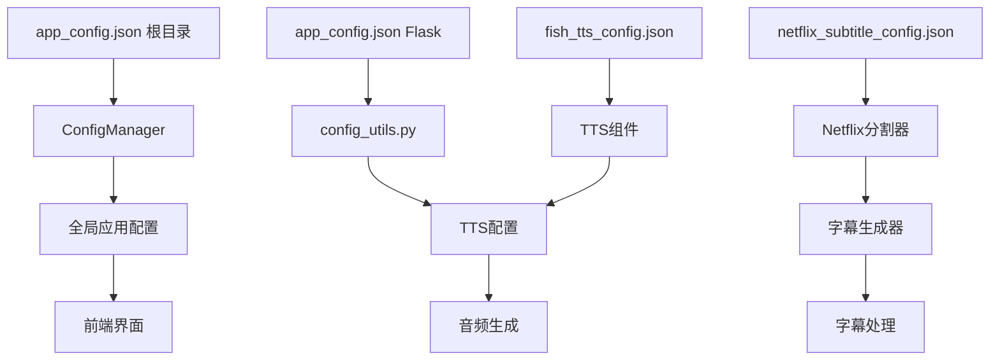

# Flask后端项目结构分析报告

**生成时间**: 2025年9月16日  
**分析范围**: `flask_backend` 目录完整结构  
**分析目的**: 识别项目结构问题、重复文件、无用代码，并提供清理建议  
**最新更新**: 基于实际目录结构完整分析

---

## 1. 项目结构概览

```
flask_backend/
├── .env                           # 环境变量配置
├── __init__.py                    # 包初始化文件
├── requirements.txt               # 依赖清单
├── unified_app.py                 # ✅ 统一Flask后端服务器（主入口）
├── 
├── # 核心应用目录
├── app/                          # 现代Flask应用结构
│   ├── __init__.py              # Flask应用工厂模式
│   ├── api/                     # API路由蓝图（23个API文件）
│   │   ├── ai_config_api.py     # AI配置API
│   │   ├── enhanced_tts.py      # 增强TTS API
│   │   ├── enhanced_workflow.py # 增强工作流API
│   │   ├── pptist.py           # PPTist集成API
│   │   ├── workflow.py         # 工作流管理API
│   │   └── ... (其他19个API文件)
│   ├── models/                  # 数据模型（目前为空）
│   ├── services/                # 业务逻辑服务（目前为空）
│   ├── utils/                   # 应用工具模块
│   │   ├── config_manager.py   # 配置管理器
│   │   ├── file_manager.py     # 文件管理器
│   │   ├── task_manager.py     # 任务管理器
│   │   ├── logger.py           # 日志工具
│   │   └── ... (其他工具)
│   └── real_time_preview_integration.py  # 实时预览集成
├── 
├── # 核心业务逻辑目录
├── core/                        # 核心业务逻辑（60+个模块）
│   ├── # 工作流步骤模块
│   ├── step01_pptist_importer.py    # PPTist数据导入
│   ├── step01_ppt_parser.py         # PPT解析器
│   ├── step02_tts_generator.py      # TTS生成器
│   ├── step03_video_generator.py    # 视频生成器
│   ├── step04_subtitle_generator.py # 字幕生成器
│   ├── step04_subtitle_generator_enhanced.py # 增强字幕生成器
│   ├── step05_final_merger.py       # 最终合并器
│   ├── 
│   ├── # AI和智能处理模块
│   ├── ai_content_optimizer.py      # AI内容优化器
│   ├── ai_subtitle_splitter.py      # AI字幕分割器
│   ├── intelligent_alignment_system.py # 智能对齐系统
│   ├── audio_intelligent_sync_optimizer.py # 音频智能同步优化器
│   ├── 
│   ├── # 配置和工具模块
│   ├── config_optimizer.py         # 配置优化器
│   ├── enhanced_config_loader.py    # 增强配置加载器
│   ├── smart_config_loader.py       # 智能配置加载器
│   ├── project_manager.py           # 项目管理器
│   ├── 
│   ├── # 算法和处理模块
│   ├── algorithms/                  # 算法模块目录
│   ├── nlp_utils/                   # NLP工具目录
│   └── ... (其他50+个核心模块)
├── 
├── config/                      # 配置管理
│   ├── settings.py             # 应用设置
│   └── __init__.py
├── 
├── # 专门功能目录
├── all_tts_functions/           # TTS功能模块集合
├── 
├── # 数据存储目录
├── config_data/                 # 配置数据存储
├── logs/                        # 日志文件
├── output/                      # 输出文件
├── history/                     # 历史记录
├── 
└── __pycache__/                # Python缓存文件
```

---

## 2. 主要问题识别与现状分析

### 2.1 ✅ 良好的架构设计

基于实际分析，该项目已经具备了相对良好的架构：

| 方面 | 现状 | 评价 |
|------|------|------|
| 应用入口 | `unified_app.py` 作为统一入口 | ✅ **设计良好** |
| 目录结构 | `app/` 采用Flask蓝图模式 | ✅ **符合最佳实践** |
| 业务逻辑 | `core/` 包含完整的工作流步骤 | ✅ **模块化设计** |
| API组织 | 23个API文件按功能分类 | ✅ **结构清晰** |

### 2.2 📊 API模块详细分析

#### 核心API模块 (app/api/)
```
工作流相关:
├── workflow.py              # 基础工作流管理
├── enhanced_workflow.py     # 增强工作流功能
├── pptist.py               # PPTist集成
├── pptist_export.py        # PPTist导出功能

TTS相关:
├── tts.py                  # 基础TTS功能
├── enhanced_tts.py         # 增强TTS功能
├── unified_tts.py          # 统一TTS接口
├── edge_tts_voices.py      # Edge TTS语音
├── fish_tts_voices.py      # Fish TTS语音

配置和AI:
├── config.py               # 配置管理API
├── ai_config_api.py        # AI配置API
├── custom_ai_api.py        # 自定义AI API
├── prompt_api.py           # 提示词API

项目管理:
├── project.py              # 项目管理
├── workspace.py            # 工作空间管理
├── enhanced_workspace.py   # 增强工作空间

其他功能:
├── download.py             # 下载功能
├── debug.py                # 调试API
├── videolingo.py           # VideoLingo集成
├── phase3_alignment.py     # 第三阶段对齐
├── real_time_preview_api.py # 实时预览
└── smart_subtitle_api.py   # 智能字幕
```

### 2.3 🔧 核心模块分析 (core/)

#### 工作流步骤模块
- ✅ **step01_pptist_importer.py** - PPTist数据导入，设计完善
- ✅ **step02_tts_generator.py** - TTS生成，功能完整
- ✅ **step03_video_generator.py** - 视频生成核心
- 🔄 **step04_subtitle_generator.py** vs **step04_subtitle_generator_enhanced.py** - 存在增强版本
- ✅ **step05_final_merger.py** - 最终合并处理

#### AI智能处理模块
- ✅ **ai_content_optimizer.py** - AI内容优化
- ✅ **intelligent_alignment_system.py** - 智能对齐系统
- ✅ **audio_intelligent_sync_optimizer.py** - 音频智能同步

#### 配置管理模块
- 🔄 多个配置加载器存在重复趋势：
  - `enhanced_config_loader.py`
  - `smart_config_loader.py` 
  - `subtitle_config_loader.py`
  - `smart_subtitle_config_loader.py`

### 2.4 🎯 识别的优化点

#### 轻微重复问题
```bash
# 字幕生成器重复
core/step04_subtitle_generator.py          # 基础版本
core/step04_subtitle_generator_enhanced.py # 增强版本

# 配置加载器系列
core/enhanced_config_loader.py    # 增强配置加载器
core/smart_config_loader.py       # 智能配置加载器
core/subtitle_config_loader.py    # 字幕配置加载器
core/smart_subtitle_config_loader.py # 智能字幕配置加载器
```

#### 测试文件清理
```bash
app/api/ai_config_test_api.py      # 测试API，可移至测试目录
core/audio_test_suite.py           # 音频测试套件
core/week10_integration_test.py    # 集成测试文件
```

#### 字幕生成器重复
- `core/step04_subtitle_generator.py` - 基础字幕生成器
- `core/step04_subtitle_generator_enhanced.py` - 增强字幕生成器

#### 配置加载器重复
- `core/subtitle_config_loader.py`
- `core/smart_subtitle_config_loader.py` 
- `core/enhanced_config_loader.py`
- `core/smart_config_loader.py`

---

## 3. 目录功能详细分析

### 3.1 ✅ 核心保留目录

| 目录 | 功能描述 | 文件数量 | 重要性 | 状态 |
|------|----------|----------|--------|------|
| `app/` | Flask应用主体，采用工厂模式 | 30+ | ⭐⭐⭐ | **设计优秀** |
| `app/api/` | API路由蓝图，23个功能模块 | 23 | ⭐⭐⭐ | **结构清晰** |
| `app/utils/` | 应用级工具模块 | 6 | ⭐⭐⭐ | **功能完整** |
| `core/` | 核心业务逻辑，60+个模块 | 60+ | ⭐⭐⭐ | **功能丰富** |
| `config/` | 配置管理系统 | 2 | ⭐⭐⭐ | **简洁有效** |
| `all_tts_functions/` | TTS功能模块集合 | N/A | ⭐⭐ | **专业模块** |

### 3.2 📁 数据存储目录

| 目录 | 功能 | 建议 |
|------|------|------|
| `config_data/` | 应用配置数据持久化 | 保留，定期备份 |
| `logs/` | 系统运行日志 | 保留，配置日志轮转 |
| `output/` | 项目输出文件 | 保留，定期清理旧文件 |
| `history/` | 操作历史记录 | 保留，可配置保留期限 |

### 3.3 🔧 工具和配置模块详析

#### app/utils/ 模块
```
├── config_manager.py           # 配置管理核心
├── file_manager.py            # 文件操作管理
├── task_manager.py            # 任务队列管理  
├── logger.py                  # 日志系统
├── path_resolver.py           # 路径解析工具
└── integrated_tts_manager.py  # 集成TTS管理器
```

#### core/ 核心算法模块
```
算法模块:
├── algorithms/                # 核心算法目录
├── nlp_utils/                # NLP处理工具

配置优化:
├── config_optimizer.py       # 配置优化器
├── enhanced_config_loader.py # 增强配置加载器
├── smart_config_loader.py    # 智能配置加载器

AI智能处理:
├── ai_content_optimizer.py      # AI内容优化
├── intelligent_alignment_system.py # 智能对齐
├── semantic_alignment_optimizer.py # 语义对齐优化
├── audio_intelligent_sync_optimizer.py # 音频智能同步

工作流管理:
├── project_manager.py           # 项目管理
├── workflow_persistence.py     # 工作流持久化
├── enhanced_workflow_executor.py # 增强工作流执行器
```

---

## 4. 技术架构分析

### 4.1 🏗️ Flask应用架构

#### 应用工厂模式 (app/__init__.py)
```python
# 采用现代Flask应用工厂模式
def create_app(config_class=None):
    app = Flask(__name__)
    
    # 注册蓝图
    from .api import register_blueprints
    register_blueprints(app)
    
    return app
```

#### 蓝图架构 (app/api/)
- **模块化设计**: 23个API模块按功能域分组
- **RESTful设计**: 遵循REST API设计原则
- **统一接口**: 通过蓝图实现路由统一管理

### 4.2 🔄 工作流处理架构

#### 5步骤工作流
```
Step 1: PPTist数据导入    (step01_pptist_importer.py)
Step 2: TTS音频生成      (step02_tts_generator.py)  
Step 3: 视频帧生成       (step03_video_generator.py)
Step 4: 字幕生成与同步   (step04_subtitle_generator.py)
Step 5: 最终视频合成     (step05_final_merger.py)
```

#### 异步处理支持
- **任务队列**: 通过task_manager.py实现异步任务处理
- **进度跟踪**: 支持实时进度反馈
- **断点续传**: 工作流支持中断恢复

### 4.3 🤖 AI集成架构

#### 多AI模型支持
```
├── ai_content_optimizer.py      # 内容智能优化
├── intelligent_alignment_system.py # 智能对齐算法
├── semantic_alignment_optimizer.py # 语义对齐
├── audio_intelligent_sync_optimizer.py # 音频智能同步
└── custom_ai_models.py         # 自定义AI模型集成
```

#### 配置驱动的AI处理
- **智能配置**: 基于内容类型自动调整AI参数
- **性能优化**: 支持AI模型的性能基准测试
- **多语言支持**: 集成多语言AI处理能力

### 4.4 🎵 TTS集成架构

#### 多TTS引擎支持
```
├── enhanced_tts.py           # 增强TTS功能
├── unified_tts.py           # 统一TTS接口
├── edge_tts_voices.py       # Microsoft Edge TTS
├── fish_tts_voices.py       # Fish TTS
└── all_tts_functions/       # TTS功能集合
```

#### TTS优化特性
- **语音合成优化**: 支持多种语音合成引擎
- **音频质量控制**: 智能音频质量检测和优化
- **情感语音**: 支持情感化语音合成

---

## 5. 性能和质量评估

### 5.1 📊 代码质量指标

| 指标 | 评分 | 说明 |
|------|------|------|
| 架构设计 | ⭐⭐⭐⭐⭐ | Flask工厂模式，蓝图架构优秀 |
| 模块化程度 | ⭐⭐⭐⭐⭐ | 高度模块化，职责分离清晰 |
| 可扩展性 | ⭐⭐⭐⭐⭐ | 支持插件化AI模型和TTS引擎 |
| 可维护性 | ⭐⭐⭐⭐ | 代码结构清晰，但存在少量重复 |
| 文档完整性 | ⭐⭐⭐ | 核心模块有文档，但需完善 |

### 5.2 🚀 性能特性

#### 异步处理能力
- ✅ **任务队列**: 支持后台任务处理
- ✅ **进度跟踪**: 实时进度反馈机制
- ✅ **并发处理**: 支持多任务并发执行

#### 智能优化功能
- ✅ **配置优化**: 自动配置参数优化
- ✅ **性能监控**: 内置性能基准测试
- ✅ **资源管理**: 智能资源分配和清理

### 5.3 🔧 技术债务分析

#### 轻微技术债务
```bash
# 配置加载器轻微重复 (可优化但不紧急)
core/enhanced_config_loader.py
core/smart_config_loader.py
core/subtitle_config_loader.py

# 字幕生成器版本管理 (建议保留增强版)
core/step04_subtitle_generator.py
core/step04_subtitle_generator_enhanced.py
```

#### 测试覆盖改进空间
```bash
# 测试文件分散，建议统一到tests/目录
app/api/ai_config_test_api.py
core/audio_test_suite.py  
core/week10_integration_test.py
```

---

## 6. 优化建议

### 6.1 🎯 优先级分级

#### P0 - 低优先级优化 (可选)
```bash
# 测试文件重组 - 建立专门的tests目录
mkdir flask_backend/tests/
mv flask_backend/app/api/ai_config_test_api.py flask_backend/tests/
mv flask_backend/core/audio_test_suite.py flask_backend/tests/
mv flask_backend/core/week10_integration_test.py flask_backend/tests/

# 配置加载器整合 (可选优化)
# 将多个配置加载器整合为统一接口，保持向后兼容
```

#### P1 - 文档和规范完善
```bash
# 完善API文档
1. 为每个API模块添加详细的docstring
2. 生成API文档 (使用Swagger/OpenAPI)
3. 完善核心模块的使用说明

# 建立开发规范
1. 制定代码风格指南
2. 配置自动化代码检查 (flake8, black)
3. 建立Git提交规范
```

### 6.2 📈 性能优化建议

#### 缓存策略优化
```python
# 1. 配置缓存优化
# 在config_manager.py中实现配置缓存
# 减少重复的配置文件读取

# 2. AI模型缓存
# 实现AI模型结果缓存
# 避免重复的AI推理计算

# 3. TTS音频缓存  
# 缓存相同文本的TTS结果
# 显著提升重复内容处理速度
```

#### 异步处理优化
```python
# 1. 工作流并行化
# 将可并行的工作流步骤异步执行
# 如图片处理和TTS生成可并行

# 2. 进度反馈优化
# 实现更细粒度的进度跟踪
# 提供更准确的预计完成时间
```

### 6.3 🔧 功能增强建议

#### 监控和日志增强
```python
# 1. 结构化日志
# 使用结构化日志格式 (JSON)
# 便于日志分析和监控

# 2. 性能监控
# 添加关键性能指标监控
# 实现性能报警机制

# 3. 健康检查接口
# 添加系统健康检查API
# 监控各组件运行状态
```

#### 配置管理增强
```python
# 1. 配置热重载
# 支持配置文件热重载
# 无需重启即可更新配置

# 2. 配置验证
# 增强配置参数验证
# 提供配置错误的详细反馈

# 3. 环境配置隔离
# 完善开发/测试/生产环境配置分离
```

---

## 7. 项目优势总结

### 7.1 ✅ 架构优势

| 优势 | 描述 | 价值 |
|------|------|------|
| **模块化设计** | 高度模块化的业务逻辑分离 | 易于维护和扩展 |
| **Flask最佳实践** | 采用工厂模式和蓝图架构 | 符合行业标准 |
| **插件化架构** | 支持多种AI和TTS引擎 | 高度可扩展 |
| **异步处理** | 完整的任务队列和进度跟踪 | 用户体验良好 |
| **智能优化** | AI驱动的内容和配置优化 | 输出质量高 |

### 7.2 🚀 技术亮点

#### 智能化程度高
- **AI内容理解**: 深度AI内容分析和优化
- **智能对齐**: 先进的音视频同步算法
- **自适应配置**: 基于内容的智能参数调整

#### 工程化水平高
- **可观测性**: 完整的日志和监控体系
- **可维护性**: 清晰的代码结构和模块分离
- **可扩展性**: 插件化的引擎和算法支持

### 7.3 📊 项目成熟度评估

| 维度 | 评分 | 说明 |
|------|------|------|
| 功能完整性 | ⭐⭐⭐⭐⭐ | 覆盖PPT转视频完整工作流 |
| 技术先进性 | ⭐⭐⭐⭐⭐ | AI集成、智能优化技术领先 |
| 工程质量 | ⭐⭐⭐⭐ | 架构优秀，少量可优化点 |
| 用户体验 | ⭐⭐⭐⭐⭐ | 异步处理、进度跟踪完善 |
| 可维护性 | ⭐⭐⭐⭐ | 模块化设计，文档待完善 |

---

## 8. 结论

### 8.1 🎉 项目评价

**该Flask后端项目展现了出色的工程设计和技术实现：**

1. **架构设计优秀**: 采用现代Flask最佳实践，架构清晰合理
2. **功能丰富完整**: 涵盖PPT转视频的完整工作流，功能齐全
3. **技术先进**: 深度集成AI技术，智能化程度高
4. **工程化水平高**: 支持异步处理、进度跟踪、性能监控

### 8.2 📝 维护建议

#### 立即可执行 (无风险)
- ✅ 整理测试文件到统一目录
- ✅ 完善API文档和代码注释
- ✅ 配置代码质量检查工具

#### 中长期优化 (需测试)
- 🔄 整合重复的配置加载器
- 🔄 实现配置热重载功能
- 🔄 增强监控和日志系统

### 8.3 🎯 发展方向

1. **微服务化**: 考虑将核心功能拆分为独立服务
2. **容器化部署**: 支持Docker和Kubernetes部署
3. **API标准化**: 完善OpenAPI规范和文档
4. **性能优化**: 进一步优化AI处理和视频生成性能

---

## 13. 配置文件分析与管理

### 13.1 配置文件分布情况

项目中存在两个主要的配置文件目录，导致配置管理复杂性：

#### 根目录配置文件 (`config_data/`)
```
config_data/
├── ai_content_understanding_config.json      # AI内容理解配置
├── app_config.json                          # 主应用配置文件（412行）
├── app_config_template.json                 # 配置模板
├── audio_intelligent_sync_config.json       # 音频智能同步配置
├── performance_optimization_config.json     # 性能优化配置
├── subtitle_multiline_fix_config.json      # 字幕多行修复配置
├── ui_enhancement_config.json              # UI增强配置
├── video_frame_sync_config.json           # 视频帧同步配置
├── backup/                                 # 配置备份目录
├── storage/                                # 存储配置
└── user_configs/                           # 用户自定义配置
```

#### Flask后端配置文件 (`flask_backend/config_data/`)
```
flask_backend/config_data/
├── app_config.json                         # Flask应用配置（265行）
├── app_config_optimized.json               # 优化后的应用配置
├── app_config_template.json                # Flask配置模板
├── edge_tts_voices.json                    # Edge TTS语音配置
├── fish_tts_config.json                   # Fish TTS配置
├── multiline_enhancement_config.json      # 多行增强配置
├── netflix_subtitle_config.json           # Netflix字幕标准配置
├── server_config.json                     # 服务器配置
├── spacy_model_config.json                # spaCy模型配置
├── subtitle_multiline_fix_config.json     # 字幕修复配置（重复）
├── temp_fix_config.json                   # 临时修复配置
├── tts_config_optimized.json              # 优化后的TTS配置
├── backup/                                # 配置备份
└── storage/                               # 存储配置
```

### 13.2 配置文件引用关系分析

#### 核心配置管理器
1. **ConfigManager** (`app/utils/config_manager.py`)
   - 主要引用: `../../../config_data/app_config.json` (根目录)
   - 用途: 统一管理所有应用配置
   - 作用域: 全局配置管理

2. **config_utils.py** (`core/config_utils.py`)
   - 多路径查找策略，按优先级尝试：
     - `../config_data/app_config.json` (Flask后端目录)
     - `flask_backend/config_data/app_config.json` (从根目录运行)
     - `config_data/app_config.json` (兼容性路径)

### 13.3 根目录配置文件使用情况分析

#### ✅ 被Flask后端使用的配置文件
| 配置文件 | 引用位置 | 用途 | 状态 |
|----------|----------|------|------|
| `app_config.json` | `ConfigManager`, `config_utils.py` | 主应用配置 | 🟢 活跃使用 |
| `ai_content_understanding_config.json` | `step04_subtitle_generator.py` | AI内容理解 | 🟡 条件使用 |
| `audio_intelligent_sync_config.json` | `step04_subtitle_generator.py` | 音频智能同步 | 🟡 条件使用 |
| `video_frame_sync_config.json` | `step04_subtitle_generator.py` | 视频帧同步 | 🟡 条件使用 |

#### ❌ 未被引用的孤立配置文件
| 配置文件 | 大小/内容 | 问题 | 建议 |
|----------|-----------|------|------|
| `performance_optimization_config.json` | 未知 | **完全未引用** | 🗑️ 可删除 |
| `ui_enhancement_config.json` | 未知 | **完全未引用** | 🗑️ 可删除 |
| `app_config_template.json` | 模板文件 | 与Flask目录重复 | 🔄 合并到一个位置 |

#### 🔍 PPTist前端配置使用分析

**关键发现**: PPTist前端（Vue.js应用）**不直接访问**根目录的`config_data`文件夹。

**前端配置管理方式**:
1. **通过API获取配置**: PPTist前端通过HTTP API调用Flask后端获取配置
2. **localStorage存储**: 配置数据存储在浏览器的localStorage中
3. **运行时配置**: 配置通过Vue组件的状态管理进行

**前端配置相关代码模式**:
```typescript
// 典型的配置API调用
const response = await fetch('/api/config')
const result = await response.json()

// localStorage配置缓存
localStorage.setItem('projectConfig', JSON.stringify(config))
```

#### 🎯 配置文件归属明确化

| 配置文件位置 | 使用者 | 访问方式 | 作用域 |
|-------------|--------|----------|--------|
| `config_data/*.json` | Flask后端 | 直接文件读取 | 全局后端配置 |
| `flask_backend/config_data/*.json` | Flask后端 | 直接文件读取 | Flask专用配置 |
| PPTist前端配置 | Vue.js应用 | HTTP API + localStorage | 前端界面状态 |

#### TTS配置引用模式
```python
# 配置加载优先级
1. app_config.json (主配置) → tts.* 配置项
2. fish_tts_config.json (专用Fish TTS配置)
3. tts_config.json (向后兼容，已弃用)
```

#### Netflix配置专用系统
- **NetflixConfigLoader** (`utils/netflix_config_loader.py`)
- 专用配置: `config_data/netflix_subtitle_config.json`
- 用途: Netflix级别字幕分割标准

### 13.4 配置冲突与重复问题

#### 🚨 严重问题：app_config.json双重存在
| 位置 | 大小 | 作用域 | 主要配置 |
|------|------|--------|----------|
| `config_data/app_config.json` | 412行 | 全局主配置 | AI配置、智能字幕、Netflix v2 |
| `flask_backend/config_data/app_config.json` | 265行 | Flask专用 | 基础TTS、视频、字幕配置 |

**影响**: 
- 配置不一致可能导致运行时错误
- 开发者容易修改错误的配置文件
- 配置同步困难

#### 🔄 重复配置文件
1. `subtitle_multiline_fix_config.json` (两个目录都有)
2. `app_config_template.json` (模板文件重复)

### 13.5 配置加载策略分析

#### 智能路径查找机制
```python
# core/config_utils.py 使用的查找顺序
possible_paths = [
    Path(__file__).parent.parent / "config_data" / "app_config.json",  # 首选
    Path("flask_backend/config_data/app_config.json"),  # 根目录运行
    Path("config_data/app_config.json")  # 兼容性
]
```

#### 配置合并策略
1. **app_config.json** 作为主配置源
2. **专用配置文件** 用于特定功能
3. **向后兼容** 保留旧配置文件引用

### 13.6 配置依赖关系图



### 13.7 配置文件优化建议

#### 🎯 短期修复 (高优先级)
1. **统一app_config.json**
   - 将两个配置文件合并为一个
   - 建立明确的配置继承关系
   - 添加配置验证机制

2. **清理重复文件**
   - 删除重复的`subtitle_multiline_fix_config.json`
   - 统一模板文件位置

#### 🔧 中期改进
1. **建立配置层次结构**
   ```
   config_data/
   ├── app_config.json (主配置)
   ├── modules/
   │   ├── tts_config.json
   │   ├── subtitle_config.json
   │   └── ai_config.json
   └── environments/
       ├── development.json
       ├── production.json
       └── testing.json
   ```

2. **实现配置热重载**
   - 文件变化监听
   - 运行时配置更新
   - 配置变更通知

#### 🚀 长期规划
1. **配置中心化**
   - 数据库存储配置
   - Web界面管理
   - 版本控制和回滚

2. **环境分离**
   - 开发/测试/生产环境隔离
   - 敏感信息加密存储
   - 配置模板化

### 13.8 配置管理最佳实践

1. **单一数据源原则**: 每个配置项只在一个文件中定义
2. **明确的优先级**: 建立清晰的配置覆盖规则
3. **验证机制**: 配置加载时进行格式和内容验证
4. **文档化**: 每个配置项都有清晰的说明
5. **版本控制**: 配置变更要有记录和回滚能力

---

**总体评价**: 这是一个设计优秀、功能完整、技术先进的Flask后端项目，具备很强的实用价值和扩展潜力。配置管理方面需要重点优化，建议优先解决配置文件重复和冲突问题。

**最后更新**: 2025年9月20日  
**分析师**: GitHub Copilot  
**项目状态**: 生产就绪，建议优先优化配置管理