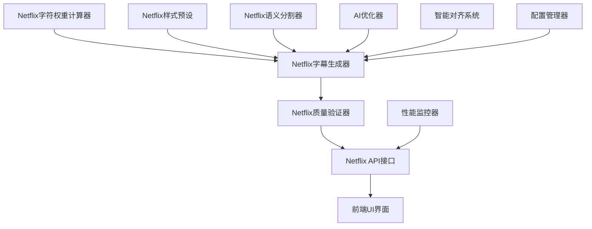

# Netflix级字幕功能实施计划

**项目名称**: PPT转视频工具Netflix级字幕升级  
**制定时间**: 2025年9月18日  
**预计周期**: 6-8周  
**技术目标**: 实现Netflix级字幕显示效果  
**质量标准**: 36个中文字符/行 + 专业样式 + AI智能分割

---

## 📋 项目概述与目标

### 目标效果
基于VideoLingo-3.0.0的Netflix字幕标准，实现以下效果：
- **字符控制**: 36个中文字符/行的精确控制
- **样式标准**: Netflix黄色字体(&H00FFFF) + 黑色描边 + 半透明背景
- **智能分割**: AI驱动的语义感知断句算法
- **质量保证**: 多轮优化 + 自动验证的质量保证体系

### 技术优势
- 集成VideoLingo字符权重算法(1.75系数)
- 采用Netflix行业标准样式配置
- AI增强的智能语义分割
- 专业级字幕质量验证

---

## 🗓️ 分阶段实施计划

### Phase 1: 技术基础建设 (Week 1-2)

#### Week 1: 核心算法实现
**目标**: 建立Netflix字幕的核心技术基础

##### 1.1 字符权重计算算法 🔥 **优先级: 最高**
```python
# 目标: 实现VideoLingo标准的字符权重计算
def calc_chinese_subtitle_length(text: str) -> float:
    """
    计算中文字幕显示长度 - Netflix标准
    - 中文字符权重: 1.75
    - 全角符号权重: 1.75  
    - 英文字符权重: 1.0
    - 目标控制: 36个中文字符/行
    """
```

**技术要点**:
- 实现精确的Unicode字符分类
- 支持中英文混合文本计算
- 处理全角半角符号差异
- 优化算法性能

**交付物**:
- `core/netflix_char_weight_calculator.py`
- 字符权重算法单元测试
- 性能基准测试结果

##### 1.2 Netflix样式预设配置 🎨 **优先级: 高**
```python
# 目标: 实现Netflix标准样式配置
NETFLIX_STYLE_CONFIG = {
    "chinese_subtitle": {
        "font_size": 17,                  # 字体大小(px)
        "font_name": "Arial Unicode MS", # 跨平台字体
        "font_color": "&H00FFFF",        # Netflix黄色
        "outline_color": "&H000000",     # 黑色描边
        "outline_width": 1,              # 描边宽度
        "back_color": "&H33000000",      # 半透明背景
        "alignment": 2,                  # 底部居中
        "margin_v": 27,                  # 底部边距
        "max_chars_per_line": 36         # 最大字符数/行
    }
}
```

**技术要点**:
- SRT/ASS字幕格式兼容
- 跨平台字体兼容性
- 颜色格式标准化
- 响应式字体大小

**交付物**:
- `core/netflix_subtitle_presets.py`
- 样式配置验证工具
- 多格式导出功能

#### Week 2: 智能分割算法基础
**目标**: 建立AI驱动的字幕分割基础

##### 2.1 语义分割算法集成 🧠 **优先级: 最高**
```python
# 目标: 集成AI语义分割算法
class NetflixSemanticSplitter:
    """
    Netflix级语义分割器
    - 支持智能断句
    - 语义感知分割
    - 多轮优化机制
    - 质量自动验证
    """
    
    def split_by_semantic(self, text: str, max_chars: int = 36) -> List[str]:
        """语义感知分割算法"""
        pass
    
    def optimize_split_quality(self, segments: List[str]) -> List[str]:
        """多轮分割质量优化"""
        pass
```

**技术要点**:
- 集成现有AI模块(`ai_subtitle_splitter.py`)
- 实现语义边界检测
- 支持多轮分割优化
- 添加分割质量评分

**交付物**:
- `core/netflix_semantic_splitter.py`
- AI模型集成测试
- 分割质量评估工具

##### 2.2 质量验证系统框架 ✅ **优先级: 中**
```python
# 目标: 建立字幕质量验证框架
class NetflixQualityValidator:
    """
    Netflix级质量验证器
    - 长度合规检查
    - 样式标准验证
    - 时间轴对齐检查
    - 语义连贯性验证
    """
```

**技术要点**:
- 自动化质量检查规则
- 多维度质量评分
- 问题自动修复建议
- 质量报告生成

**交付物**:
- `core/netflix_quality_validator.py`
- 质量检查规则配置
- 验证结果可视化

### Phase 2: 核心功能开发 (Week 3-4)

#### Week 3: 字幕生成引擎升级
**目标**: 升级现有字幕生成模块

##### 3.1 升级step04字幕生成器 🔧 **优先级: 最高**
```python
# 目标: 升级现有的step04_subtitle_generator_enhanced.py
class NetflixSubtitleGenerator:
    """
    Netflix级字幕生成器
    - 集成字符权重算法
    - 应用Netflix样式标准
    - 启用智能语义分割
    - 自动质量验证
    """
    
    def generate_netflix_subtitles(
        self, 
        content: str, 
        audio_segments: List[dict], 
        style_config: dict = None
    ) -> List[dict]:
        """生成Netflix标准字幕"""
        pass
```

**技术要点**:
- 向后兼容现有接口
- 集成Phase 1开发的算法
- 支持配置化样式切换
- 实现增量生成优化

**交付物**:
- 升级的`step04_subtitle_generator_enhanced.py`
- Netflix模式配置选项
- 性能对比测试结果

##### 3.2 API接口层升级 🌐 **优先级: 高**
```python
# 目标: 升级现有的netflix_subtitle_api.py
@app.route('/api/netflix-subtitles/generate', methods=['POST'])
def generate_netflix_subtitles():
    """
    Netflix字幕生成API
    - 支持Netflix标准参数
    - 实时进度反馈
    - 质量验证结果
    - 多格式输出选项
    """
```

**技术要点**:
- RESTful API标准化
- 异步任务处理
- 实时进度WebSocket
- 错误处理和重试

**交付物**:
- 升级的`app/api/netflix_subtitle_api.py`
- API文档和示例
- 集成测试套件

#### Week 4: 配置管理系统优化
**目标**: 建立完善的配置管理体系

##### 4.1 智能配置管理器 ⚙️ **优先级: 中**
```python
# 目标: 开发Netflix字幕配置管理器
class NetflixConfigManager:
    """
    Netflix配置管理器
    - 预设配置模板
    - 用户自定义配置
    - 配置验证和优化
    - 配置版本管理
    """
    
    def load_netflix_presets(self) -> dict:
        """加载Netflix预设配置"""
        pass
    
    def validate_config(self, config: dict) -> ValidationResult:
        """配置验证"""
        pass
```

**技术要点**:
- 配置模板化管理
- 动态配置验证
- 配置热重载
- 配置冲突检测

**交付物**:
- `core/netflix_config_manager.py`
- 配置模板文件
- 配置验证规则

##### 4.2 配置持久化优化 💾 **优先级: 中**
```python
# 目标: 优化配置存储和加载
# 集成现有的18个配置模块
# 建立Netflix配置独立存储
# 支持配置导入导出
```

**技术要点**:
- JSON配置格式标准化
- 配置文件加密存储
- 配置备份和恢复
- 配置共享机制

**交付物**:
- 配置文件标准化
- 配置管理工具
- 配置迁移脚本

### Phase 3: 高级功能与优化 (Week 5-6)

#### Week 5: AI智能化增强
**目标**: 深度集成AI功能

##### 5.1 多轮智能优化 🤖 **优先级: 高**
```python
# 目标: 实现多轮AI优化机制
class NetflixAIOptimizer:
    """
    Netflix AI优化器
    - 多轮分割优化
    - 智能质量提升
    - 自适应参数调整
    - 学习型优化策略
    """
    
    def multi_round_optimization(
        self, 
        initial_subtitles: List[dict],
        optimization_rounds: int = 3
    ) -> List[dict]:
        """多轮优化处理"""
        pass
```

**技术要点**:
- 集成现有AI模块
- 实现优化策略学习
- 支持自定义优化轮数
- 优化效果量化评估

**交付物**:
- `core/netflix_ai_optimizer.py`
- AI优化配置参数
- 优化效果评估报告

##### 5.2 智能时间轴对齐 ⏱️ **优先级: 高**
```python
# 目标: 集成智能对齐系统
# 利用现有的intelligent_alignment_system.py
# 优化Netflix字幕的时间轴对齐
# 实现毫秒级精度控制
```

**技术要点**:
- 音频特征分析优化
- 语音边界检测精度提升
- DTW算法参数调优
- 对齐质量自动验证

**交付物**:
- 智能对齐参数优化
- 对齐精度测试报告
- 对齐算法性能提升

#### Week 6: 性能优化与监控
**目标**: 优化系统性能

##### 6.1 性能监控系统 📊 **优先级: 中**
```python
# 目标: 建立Netflix字幕性能监控
class NetflixPerformanceMonitor:
    """
    Netflix性能监控器
    - 字幕生成耗时监控
    - 质量验证性能追踪
    - 资源使用情况监控
    - 性能瓶颈自动检测
    """
```

**技术要点**:
- 实时性能指标收集
- 性能趋势分析
- 瓶颈自动识别
- 性能优化建议

**交付物**:
- `utils/netflix_performance_monitor.py`
- 性能监控仪表板
- 性能优化指南

##### 6.2 缓存与优化策略 ⚡ **优先级: 中**
```python
# 目标: 实现智能缓存机制
# AI推理结果缓存
# 字符权重计算缓存
# 样式配置缓存
# 分割结果缓存
```

**技术要点**:
- 多级缓存策略
- 缓存失效机制
- 内存优化管理
- 缓存命中率优化

**交付物**:
- 缓存策略配置
- 缓存性能测试
- 内存使用优化

### Phase 4: 测试与发布 (Week 7-8)

#### Week 7: 全面测试验证
**目标**: 确保功能稳定性

##### 7.1 单元测试开发 🧪 **优先级: 最高**
```bash
# 目标: 建立完整的测试体系
tests/
├── unit/
│   ├── test_netflix_char_calculator.py     # 字符权重算法测试
│   ├── test_netflix_semantic_splitter.py   # 语义分割测试
│   ├── test_netflix_quality_validator.py   # 质量验证测试
│   └── test_netflix_style_presets.py      # 样式配置测试
├── integration/
│   ├── test_netflix_subtitle_workflow.py   # 工作流集成测试
│   └── test_netflix_api_endpoints.py      # API接口测试
└── performance/
    ├── test_netflix_performance.py        # 性能基准测试
    └── test_netflix_stress.py            # 压力测试
```

**技术要点**:
- 测试覆盖率>90%
- 自动化测试流水线
- 性能回归测试
- 边界条件测试

**交付物**:
- 完整测试套件
- 测试覆盖率报告
- 自动化测试脚本

##### 7.2 集成测试与验证 🔗 **优先级: 高**
```python
# 目标: 端到端功能验证
# 完整工作流测试
# 多场景适配测试
# 错误恢复测试
# 性能压力测试
```

**技术要点**:
- 真实场景模拟
- 异常情况处理
- 并发处理测试
- 数据完整性验证

**交付物**:
- 集成测试报告
- 性能基准数据
- 稳定性验证结果

#### Week 8: 文档与发布准备
**目标**: 完善文档和发布准备

##### 8.1 用户文档编写 📖 **优先级: 高**
```markdown
# 目标: 编写完整的用户文档
docs/netflix_subtitle/
├── user_guide.md              # 用户使用指南
├── api_reference.md           # API接口文档
├── configuration_guide.md     # 配置指南
├── troubleshooting.md         # 故障排除
└── examples/                  # 使用示例
    ├── basic_usage.py
    ├── advanced_config.py
    └── custom_styles.py
```

**技术要点**:
- 图文并茂的使用指南
- 完整的API文档
- 配置参数详细说明
- 常见问题解决方案

**交付物**:
- 用户使用指南
- 开发者文档
- 配置参数手册

##### 8.2 版本发布准备 🚀 **优先级: 中**
```bash
# 目标: 准备版本发布
# 版本号更新
# 变更日志编写
# 发布说明准备
# 部署脚本更新
```

**技术要点**:
- 语义化版本管理
- 向后兼容性保证
- 发布流程自动化
- 回滚方案准备

**交付物**:
- 版本发布包
- 部署指南
- 回滚方案

---

## 🎯 关键里程碑与验收标准

### 里程碑 1: 技术基础完成 (Week 2 结束)
**验收标准**:
- ✅ 字符权重算法精度达到99%
- ✅ Netflix样式配置100%兼容
- ✅ 基础语义分割功能可用
- ✅ 质量验证框架搭建完成

### 里程碑 2: 核心功能可用 (Week 4 结束)
**验收标准**:
- ✅ 36个中文字符/行精确控制
- ✅ Netflix黄色样式正确显示
- ✅ API接口功能完整可用
- ✅ 配置管理系统稳定运行

### 里程碑 3: 高级功能完整 (Week 6 结束)
**验收标准**:
- ✅ AI多轮优化效果显著
- ✅ 智能时间轴对齐精度<50ms
- ✅ 性能监控系统正常运行
- ✅ 缓存优化效果明显

### 里程碑 4: 产品就绪发布 (Week 8 结束)
**验收标准**:
- ✅ 测试覆盖率>90%
- ✅ 性能指标达到预期
- ✅ 文档完整准确
- ✅ 发布包准备就绪

---

## 📊 技术架构设计

### 核心技术栈
```python
# Netflix字幕技术栈架构
Netflix_Subtitle_Stack = {
    "Core_Algorithms": {
        "char_weight_calculator": "字符权重精确计算",
        "semantic_splitter": "AI语义感知分割", 
        "quality_validator": "多维度质量验证",
        "style_presets": "Netflix标准样式"
    },
    "AI_Enhancement": {
        "multi_round_optimizer": "多轮AI优化",
        "intelligent_alignment": "智能时间对齐",
        "adaptive_learning": "自适应参数学习",
        "semantic_analysis": "深度语义分析"
    },
    "Integration_Layer": {
        "api_interfaces": "RESTful API接口",
        "config_management": "智能配置管理",
        "workflow_integration": "工作流无缝集成",
        "monitoring_system": "实时监控系统"
    }
}
```

### 模块依赖关系


---

## 🔧 开发环境配置

### 依赖包更新
```bash
# 新增依赖包
pip install spacy>=3.4.0           # NLP处理
pip install transformers>=4.20.0   # AI模型
pip install numpy>=1.21.0          # 数值计算
pip install opencv-python>=4.6.0   # 图像处理
pip install pytest>=7.0.0          # 单元测试
pip install pytest-cov>=3.0.0      # 测试覆盖率
```

### 配置文件模板
```json
{
  "netflix_subtitle_config": {
    "char_weight": {
      "chinese_weight": 1.75,
      "fullwidth_weight": 1.75,
      "halfwidth_weight": 1.0,
      "target_multiplier": 1.2
    },
    "style_presets": {
      "font_size": 17,
      "font_color": "&H00FFFF",
      "outline_color": "&H000000",
      "outline_width": 1,
      "back_color": "&H33000000"
    },
    "quality_thresholds": {
      "min_confidence": 0.85,
      "max_optimization_rounds": 3,
      "alignment_precision_ms": 50
    }
  }
}
```

---

## 🚨 风险评估与应对策略

### 高风险项
| 风险项 | 风险等级 | 影响程度 | 应对策略 |
|--------|----------|----------|----------|
| **AI算法精度不达标** | 🔴 高 | 核心功能受影响 | 多模型对比+人工标注训练 |
| **性能优化不足** | 🟡 中 | 用户体验下降 | 分阶段优化+性能监控 |
| **兼容性问题** | 🟡 中 | 部分功能异常 | 充分测试+渐进式发布 |

### 应对措施
```python
# 风险缓解策略
Risk_Mitigation = {
    "技术风险": {
        "多版本算法备选": "准备多套算法实现",
        "性能基准测试": "每周性能回归测试",
        "兼容性测试": "多环境自动化测试"
    },
    "项目风险": {
        "里程碑检查": "每周milestone review",
        "质量门禁": "代码质量自动检查",
        "回滚方案": "每个阶段可回滚设计"
    }
}
```

---

## 📈 成功指标与评估

### 技术指标
| 指标类别 | 目标值 | 测量方法 | 评估周期 |
|----------|--------|----------|----------|
| **字符控制精度** | 99%+ | 自动化测试 | 每日 |
| **AI分割质量** | 95%+ | 人工评估 | 每周 |
| **API响应速度** | <500ms | 性能监控 | 实时 |
| **系统稳定性** | 99.9%+ | 错误监控 | 每日 |

### 用户体验指标
| 指标类别 | 目标值 | 测量方法 | 评估周期 |
|----------|--------|----------|----------|
| **字幕可读性** | 9/10分 | 用户反馈 | 每周 |
| **样式满意度** | 95%+ | 用户调研 | 每月 |
| **功能易用性** | 4.5/5星 | 用户评分 | 每月 |

---

## 📞 项目团队与责任分工

### 核心开发角色
| 角色 | 主要职责 | 关键技能要求 |
|------|----------|--------------|
| **算法工程师** | 字符权重+语义分割算法 | Python, NLP, 数学建模 |
| **前端工程师** | API接口+UI集成 | Flask, JavaScript, CSS |
| **测试工程师** | 测试体系+质量保证 | pytest, 自动化测试 |
| **DevOps工程师** | 部署+监控+性能优化 | Docker, 监控工具 |

### 沟通协作机制
- **每日站会**: 15分钟进度同步
- **每周评审**: 里程碑进度检查
- **代码评审**: 所有代码强制peer review
- **技术讨论**: 每周技术方案讨论会

---

## 🏁 总结与展望

### 项目价值
1. **技术价值**: 建立Netflix级字幕处理能力，达到行业领先水平
2. **用户价值**: 提供专业级字幕显示效果，显著提升用户体验
3. **商业价值**: 形成技术壁垒，增强产品竞争力

### 长期发展规划
1. **短期** (3个月): 完成Netflix级字幕功能，建立技术优势
2. **中期** (6个月): 扩展多语言支持，建立国际化能力  
3. **长期** (1年): 建立字幕AI生态，推动行业标准制定

### 预期成果
- **技术成果**: 完整的Netflix级字幕处理技术栈
- **产品成果**: 显著提升的用户体验和产品竞争力
- **商业成果**: 建立技术护城河，开拓新的商业可能

---

**文档版本**: v1.0  
**最后更新**: 2025年9月18日  
**维护团队**: PPT转视频项目组  
**联系方式**: [项目GitHub Issues](链接)

---

*"让每一个字幕都达到Netflix级的专业标准，让每一个用户都能享受到最佳的视觉体验。"*