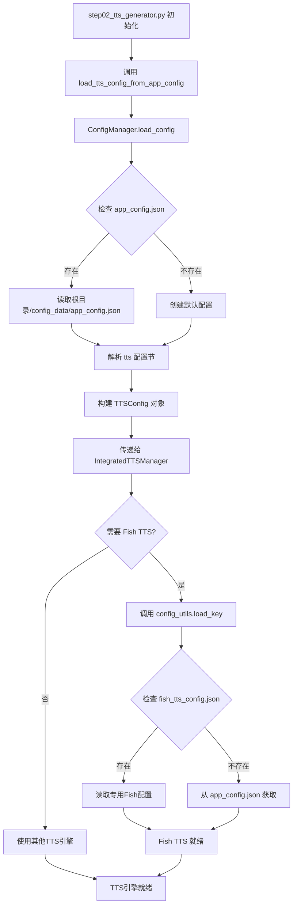

# TTS配音生成步骤配置文件依赖分析

**分析文件**: `flask_backend/core/step02_tts_generator.py`  
**分析时间**: 2025年9月20日  
**分析范围**: 直接和间接的配置文件依赖关系

---

## 📋 配置文件依赖关系总览

### 🔴 直接依赖的配置文件

| 配置文件 | 路径 | 用途 | 访问方式 |
|----------|------|------|----------|
| `app_config.json` | `根目录/config_data/` 或 `flask_backend/config_data/` | **主配置文件** - TTS引擎设置 | ConfigManager |
| `fish_tts_config.json` | `flask_backend/config_data/` | Fish TTS专用配置 | config_utils.py |

### 🟡 间接依赖的配置文件

| 配置文件 | 通过模块 | 用途 |
|----------|----------|------|
| 日志配置 | `app.utils.logger` | 日志输出设置 |
| 文件管理配置 | `app.utils.file_manager` | 项目目录结构 |

---

## 🔍 详细依赖链分析

### 1️⃣ 主配置加载链

```python
step02_tts_generator.py
    ↓ 调用
load_tts_config_from_app_config()
    ↓ 位于
app.utils.integrated_tts_manager
    ↓ 调用
config_manager.load_config()
    ↓ 位于
app.utils.config_manager
    ↓ 读取文件
../../../config_data/app_config.json (优先)
```

**配置文件路径解析**:
```python
# ConfigManager中的路径计算
self.config_dir = Path(__file__).parent.parent.parent / "config_data"
# 实际路径: ppt_to_video/config_data/app_config.json
```

### 2️⃣ Fish TTS配置加载链

```python
step02_tts_generator.py
    ↓ 创建
IntegratedTTSManager(config)
    ↓ 初始化引擎时可能调用
all_tts_functions.fish_tts
    ↓ 导入
core.config_utils.load_key("fish_tts")
    ↓ 读取文件（按优先级）
1. flask_backend/config_data/fish_tts_config.json (首选)
2. flask_backend/config_data/app_config.json (备用)
3. config_data/app_config.json (兼容性)
```

---

## 📊 配置项详细映射

### `app_config.json` 中的TTS相关配置

```json
{
  "tts": {
    "preferred_engine": "edge_tts",          // 首选TTS引擎
    "edge_voice": "zh-CN-XiaoxiaoNeural",   // Edge TTS语音
    "edge_rate": "+0%",                     // 语速
    "edge_pitch": "+0Hz",                   // 音调
    "fish_api_key": "",                     // Fish TTS API密钥
    "fish_character": "雷军",               // Fish TTS角色
    "openai_api_key": "",                   // OpenAI TTS API密钥
    "openai_voice": "alloy",                // OpenAI TTS语音
    "openai_model": "tts-1",                // OpenAI TTS模型
    "azure_api_key": "",                    // Azure TTS API密钥
    "azure_region": "eastus",               // Azure TTS区域
    "azure_voice": "zh-CN-XiaoxiaoNeural"   // Azure TTS语音
  }
}
```

### `fish_tts_config.json` 专用配置

```json
{
  "api_key": "f9515b8c22e74f49a8ac8b7a487b42e9",
  "character": "雷军",
  "character_id_dict": {
    "AD学姐": "7f92f8afb8ec43bf81429cc1c9199cb1",
    "丁真": "54a5170264694bfc8e9ad98df7bd89c3",
    "赛马娘": "0eb38bc974e1459facca38b359e13511",
    "蔡徐坤": "e4642e5edccd4d9ab61a69e82d4f8a14",
    "雷军": "738d0cc1a3e9430a9de2b544a466a7fc"
  }
}
```

---

## 🔄 配置加载流程图



---

## ⚙️ 运行时配置处理

### 配置优先级规则

1. **Fish TTS**: 专用配置文件 > app_config.json > 默认值
2. **其他TTS引擎**: app_config.json > 默认值
3. **路径查找**: Flask目录 > 根目录 > 兼容性路径

### 配置更新机制

```python
# TTS生成器支持运行时配置更新
def update_tts_config(self, **kwargs):
    """更新TTS配置"""
    for key, value in kwargs.items():
        if hasattr(self.tts_config, key):
            setattr(self.tts_config, key, value)
```

---

## 🚨 潜在问题与风险

### 配置文件冲突风险

1. **app_config.json双重存在**:
   - 根目录版本 (412行) vs Flask目录版本 (265行)
   - 可能导致配置不一致

2. **Fish TTS配置分散**:
   - 专用配置文件 vs app_config.json中的fish_*配置
   - 优先级可能混乱

### 路径依赖问题

```python
# config_utils.py中的多路径查找可能导致:
# 1. 开发环境与生产环境行为不一致
# 2. 配置更新时不知道修改哪个文件
possible_paths = [
    Path(__file__).parent.parent / "config_data" / "app_config.json",  # Flask目录
    Path("flask_backend/config_data/app_config.json"),  # 从根目录运行
    Path("config_data/app_config.json")  # 兼容性路径
]
```

---

## 📈 优化建议

### 短期修复
1. **统一app_config.json**: 只保留一个主配置文件
2. **明确Fish TTS配置**: 要么全用专用文件，要么全在主配置中
3. **配置路径标准化**: 确定唯一的配置文件查找路径

### 长期改进
1. **配置验证**: 添加配置格式和内容验证
2. **配置热重载**: 支持运行时配置更新
3. **环境隔离**: 开发/测试/生产环境配置分离

---

## 📝 总结

`step02_tts_generator.py` 的配置依赖关系相对复杂，主要依赖：

✅ **主要配置**: `config_data/app_config.json`  
✅ **专用配置**: `flask_backend/config_data/fish_tts_config.json`  
⚠️ **风险点**: 配置文件重复和路径查找的复杂性

建议优先统一配置文件管理，减少配置冲突风险。