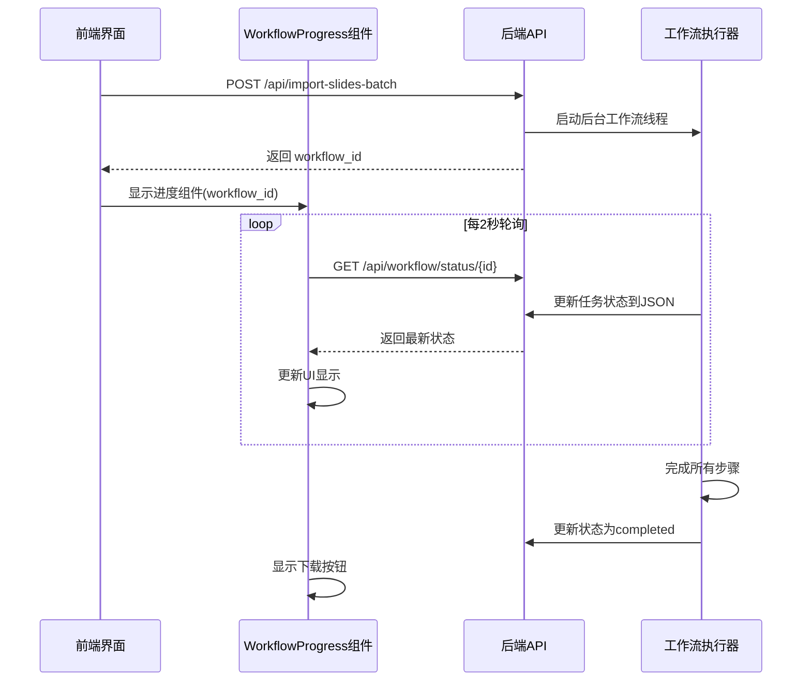

# 🔧 工作流进度追踪 - 修复说明

## ✅ 已修复的问题

### 1. 后端 progress_callback 参数错误
**问题**: TypeError: missing 2 required positional arguments: 'progress' and 'message'

**原因**: `EnhancedWorkflowExecutor`调用`progress_callback(execution)`传递WorkflowExecution对象,但我们定义的回调期望3个独立参数

**修复**:
```python
# 修改前
def progress_callback(step_name: str, progress: float, message: str):
    ...

# 修改后  
async def progress_callback(execution):
    """接收WorkflowExecution对象"""
    current_step_name = execution.current_step
    step_info = execution.steps[current_step_name]
    step_progress = step_info.progress
    ...
```

**文件**: `flask_backend/api/batch_import.py`

---

### 2. 前端未退出演示模式
**问题**: 图片导出完成后停留在Screen模式,用户需要手动按ESC退出

**修复**:
```typescript
// 修改前
setTimeout(() => {
  screenStore.setScreening(false)
}, 1000)

// 修改后
screenStore.setScreening(false)
message.success('已退出演示模式,可在右侧查看工作流进度')
```

**文件**: `PPTist/src/views/Screen/BaseView.vue`

---

### 3. 进度组件改为当前任务监控
**问题**: 原设计同时显示历史任务和当前任务,界面复杂

**改进**:
- ✅ 只显示当前正在执行的工作流任务
- ✅ 右下角浮动窗口,不遮挡编辑区
- ✅ 5个步骤详细展示:准备、TTS、字幕、视频、合并
- ✅ 每个步骤显示:图标、名称、状态、消息

**UI布局**:
```
┌────────────────────────────────┐
│ 📊 视频生成进度        [⬇][✕]│ ← 标题栏(可点击收起)
├────────────────────────────────┤
│ 项目名称               ▶️进行中│ ← 项目信息
│ 总进度         [████████  ] 80%│ ← 总进度条
│                                │
│ ✅ 准备阶段          已完成    │ ← 步骤详情
│ ✅ TTS音频生成        已完成    │
│ ✅ 字幕文件生成       已完成    │
│ ▶️ 视频片段合成       处理中... │  
│ ⏸️ 最终视频合并       等待开始  │
└────────────────────────────────┘
```

**文件**: `PPTist/src/components/WorkflowProgress.vue`

---

### 4. 支持收起/展开
**新功能**:
- 点击标题栏收起/展开内容区域
- 收起时只显示`📊`图标和操作按钮(60px高度)
- 展开时显示完整进度详情(最高85vh)

**交互**:
```
展开状态 (450px × 最高85vh):
┌────────────────┐
│ 📊进度  [⬇][✕]│
│  [详细内容]    │
│  [步骤列表]    │
└────────────────┘

收起状态 (450px × 60px):
┌────────────────┐
│ 📊      [⬆][✕]│
└────────────────┘
```

---

## 🎨 UI/UX 改进

### 状态徽章
- ⏳ **等待中** - 灰色背景 (#f0f0f0)
- ▶️ **进行中** - 蓝色背景 (#e6f7ff) + 脉冲动画
- ✅ **已完成** - 绿色背景 (#f6ffed)
- ❌ **失败** - 红色背景 (#fff1f0)

### 进度条
- 渐变色填充: #667eea → #764ba2
- 平滑动画过渡(0.5s ease)
- 百分比实时显示

### 步骤卡片
- 待处理: 灰色背景
- 运行中: 蓝色背景 + 脉冲指示器
- 已完成: 绿色背景 + ✅图标
- 失败: 红色背景 + ❌图标

---

## 📊 数据流程



---

## 🧪 测试步骤

### 1. 启动服务
```powershell
# 后端
python flask_backend/unified_app.py

# 前端  
cd PPTist
npm run dev
```

### 2. 测试流程
1. 打开PPTist编辑器 (http://localhost:5173)
2. 创建或打开PPT项目
3. 点击"🎬 视频导出"按钮
4. **验证点1**: 自动进入Screen模式并开始批量导出
5. **验证点2**: 导出完成后自动退出Screen模式
6. **验证点3**: 右下角弹出进度浮动窗口
7. **验证点4**: 可以点击标题栏收起/展开
8. **验证点5**: 步骤进度实时更新

### 3. 检查后端日志
```
✅ 已保存: slide_001.jpg (303.9 KB)
✅ 已保存: slide_002.jpg (361.9 KB)
...
✅ 元数据已保存
✅ 工作流线程已启动: workflow_xxx
🚀 工作流已启动: workflow_xxx

开始执行工作流: uuid
执行步骤: step01_data_preparation
执行步骤: step02_tts_generation
...
```

应该**没有**TypeError错误!

---

## 📁 修改的文件

1. `flask_backend/api/batch_import.py`
   - 修复 `progress_callback` 函数签名
   - 从 WorkflowExecution 对象提取进度信息
   - 正确映射步骤名称和索引

2. `PPTist/src/views/Screen/BaseView.vue`
   - 导出完成后立即退出Screen模式
   - 添加用户提示消息

3. `PPTist/src/components/WorkflowProgress.vue`
   - 完全重写为浮动窗口设计
   - 只显示当前任务(移除历史列表)
   - 添加收起/展开功能
   - 步骤详细显示和动画效果

4. `PPTist/src/App.vue`
   - 移除 WorkflowHistoryPanel 组件引用

---

## 🎯 下一步优化建议

### 可选功能
1. **WebSocket替代轮询** - 实时推送进度,降低服务器压力
2. **任务历史记录** - 独立页面查看历史任务
3. **进度估算** - 显示预计剩余时间
4. **失败重试** - 一键重新执行失败的工作流
5. **通知推送** - 完成时桌面通知

### 性能优化
1. 完成/失败后停止轮询(已实现✅)
2. 错误时指数退避重试
3. 轮询间隔动态调整(慢步骤3s,快步骤1s)

---

## 📝 API文档

### GET /api/workflow/status/{workflow_id}

**响应格式**:
```json
{
  "success": true,
  "workflow": {
    "workflow_id": "workflow_xxx",
    "status": "running",
    "progress": 60,
    "project_name": "我的项目",
    "current_step": 3,
    "total_steps": 5,
    "steps": [
      {
        "name": "准备阶段",
        "status": "completed",
        "message": "已完成"
      },
      {
        "name": "TTS音频生成",
        "status": "completed",
        "message": "已完成"
      },
      {
        "name": "字幕文件生成",
        "status": "completed",
        "message": "已完成"
      },
      {
        "name": "视频片段合成",
        "status": "running",
        "message": "正在合成第15/30个片段"
      },
      {
        "name": "最终视频合并",
        "status": "pending",
        "message": "等待开始"
      }
    ],
    "error": "",
    "updated_at": "2025-10-22T15:30:00"
  }
}
```

---

## ✨ 总结

这次修复彻底解决了工作流进度追踪的4个核心问题:

1. ✅ **后端回调参数错误** - 修复TypeError
2. ✅ **前端未退出演示** - 立即返回编辑器
3. ✅ **进度组件简化** - 专注当前任务
4. ✅ **支持收起展开** - 提升用户体验

现在用户可以:
- 一键导出视频,无需手动退出演示模式
- 实时查看当前任务的详细进度
- 收起进度窗口专注编辑,需要时展开查看
- 清晰了解每个步骤的状态和消息

🎉 **问题已全部修复,可以开始测试!**
